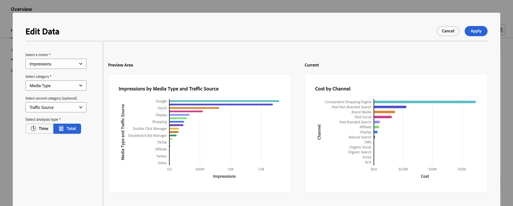

# 調整済みデータの概要

AdobeMix Modeler の概要の「Harmonized Data」タブでは、取り込んだデータと調和されたデータ設定の一部として使用するように設定した、調和されたデータに関するインサイトを提供します。

概要には、4 つの KPI ステータスカードウィジェット（上の行）と、その他 6 つの設定可能なウィジェットが表示されます。

ウィジェットに表示するデータの日付期間を変更するには、開始日と終了日を手動で入力するか、 .

## データフィルター

すべてのウィジェットで表示されるデータは、  **[!UICONTROL Data Filters]** ウィンドウ

各カテゴリに対して 1 つ以上のフィルターを選択します (**[!UICONTROL Channel]**, **[!UICONTROL Brand]**, **[!UICONTROL Source Type]**、および **[!UICONTROL Traffic Source]**) をクリックします。

選択したフィルターは、次のウィジェットの上に表示されます： **[!UICONTROL FILTERING BY:]**.

1. 個々のフィルターを削除するには、  フィルターのリスト： **[!UICONTROL FILTERING BY:]**.

1. 次を使用して、すべてのフィルターをすばやくクリアできます： **[!UICONTROL Clear All]**.

## ウィジェットの設定

各ウィジェットを設定できます。

* KPI ステータスカードウィジェットで、次の操作を行います。

   1. 選択  および  **[!UICONTROL Edit Data]** を選択します。

   1. Adobe Analytics の **[!UICONTROL KPI status card]** ダイアログ：

      1. を選択します。 **[!UICONTROL KPI]** を選択します。

      1. 選択 **[!UICONTROL Apply]** をクリックして、変更をカードに適用します。 選択 **[!UICONTROL Cancel]** をクリックして変更をキャンセルします。

* その他の設定可能なウィジェットでは、次の手順を実行します。

   1. 選択  および  **[!UICONTROL Edit Data]** を選択します。

   1. Adobe Analytics の **[!UICONTROL Edit Data]** ダイアログ：

      1. 次から指標を選択： **[!UICONTROL Select a metric]**&#x200B;例： **[!UICONTROL Impressions]**.
      1. カテゴリの選択元 **[!UICONTROL Select category]**&#x200B;例： **[!UICONTROL Media Type]**.
      1. （オプション）次の中から 2 つ目のカテゴリを選択します。 **[!UICONTROL Select second category (optional)]**&#x200B;例： **[!UICONTROL Traffic Source]**.
      1. 選択  **[!UICONTROL Time]** または  **[!UICONTROL Total]** を次の場所にある分析タイプとして使用 **[!UICONTROL Select analysis type]**.

         次を選択した場合、  **[!UICONTROL Time]**&#x200B;に値を入力しない場合は、時間の頻度を指定できます。 選択 **[!UICONTROL Daily]**, **[!UICONTROL Weekly]**, **[!UICONTROL Monthly]** または **[!UICONTROL Quarterly]** から **[!UICONTROL Select time frequency]**.

         現在の選択の更新されたプレビューが、 [!UICONTROL Preview Area] そして現在のウィジェットが [!UICONTROL Current].

         

         データが使用できずプレビューをレンダリングできない場合は、「  [!UICONTROL Insights Not Available] - [!UICONTROL Harmonized fields are not available].

      1. 選択 **[!UICONTROL Apply]** をクリックして、ウィジェットに変更を適用します。 選択 **[!UICONTROL Cancel]** 現在のウィジェットに対する変更をキャンセルする場合。

