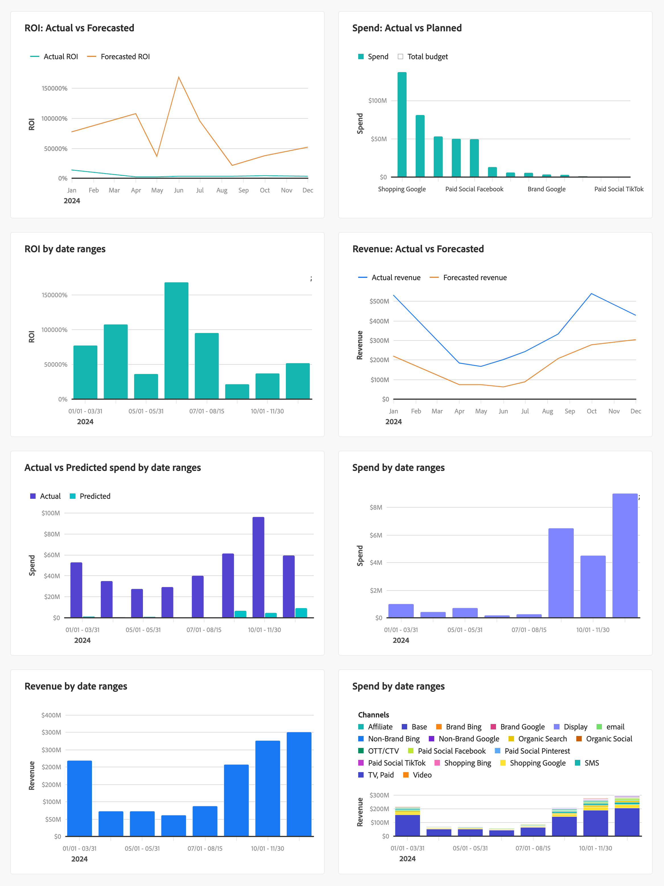

# 計画するパフォーマンス

>[!NOTE]
>
>Mix Modeler の「**[!UICONTROL Plans]** [!BADGE Alpha]{type=Informative}」タブはアルファ機能で **[!UICONTROL Overview]** その機能は変更される場合があります。 この機能を使用できるのは、限られた数のお客様です。

Mix Modeler  **[!UICONTROL Overview]** の **[!UICONTROL Plans]** [!BADGE Alpha]{type=Informative} タブには、マーケティングがプランに対してどの程度効果を発揮しているかを監視するトラッキングダッシュボードが表示されます。

KPI ステータス・カードおよびビジュアライゼーションに表示するデータを選択するには、次の手順を実行します。

* **[!UICONTROL Plan name]** ドロップダウンメニューから **[!UICONTROL _オプションを選択…_]** を使用して、プランを選択します。

* 期間を指定します。 日付範囲を変更するには、開始日と終了日を手動で入力するか、 を使用して日付範囲を選択します。

「**[!UICONTROL Plans]** [!BADGE Alpha]{type=Informative}」タブには、次の情報が表示されます。

* KPI ステータスカード

   * [予算](#budget)
   * [収益](#revenue)
   * [ROI](#roi)
   * [注文件数](#orders)

* ビジュアライゼーション：
   * [ROI：実際と予測の比較](#roi-actual-vs-forecasted)
   * [支出：実際と予定](#spend-actual-vs-planned)
   * [日付範囲別の ROI](#roi-by-date-ranges)
   * [収益：実収益と予測](#revenue-actual-vs-forecasted)
   * [実際の日付範囲と予測日付範囲](#actual-vs-predicted-spend-by-date-ranges)
   * [費用（日付範囲別）](#spend-by-date-ranges)
   * [収益（日付範囲別）](#revenue-by-date-ranges)
   * [日付範囲（およびチャネル）別の支出](#spend-by-date-ranges-and-channels)

## KPI ステータスカード

### 予算

マーケティング費用とプランの予算との比較を期間ごとに表示する、円形の進捗ビジュアライゼーション。

### 収益

日付範囲での実収益と予定ターゲット収益の比較方法を表示する、循環的な進捗ビジュアライゼーション。

### ROI

期間の ROI を表示する線のビジュアライゼーション。

### 注文件数

期間の注文を表示する折れ線グラフ ビジュアライゼーション。

別の KPI を選択する手順は、次のとおりです。

1. 「」を選択します。
1. **[!UICONTROL KPI status card]** ダイアログで、**[!UICONTROL KPI]** ドロップダウンメニューから KPI を選択します。

## ビジュアライゼーション

### ROI：実際と予測の比較

期間の実際の ROI と予測 ROI を比較する線のビジュアライゼーション。

### 支出：実際と予定

期間のチャネルをまたいで実際の支出と予定予算を比較する棒グラフビジュアライゼーション。

### 日付範囲別の ROI

期間の日付範囲ごとの ROI を表示する棒グラフビジュアライゼーション。

### 収益：実収益と予測

日付範囲の実収益と予測収益を比較する線のビジュアライゼーション。

### 実績費用と予測費用（日付範囲別）

日付範囲の日付範囲別に、実際の支出と予測された支出を示す棒グラフビジュアライゼーション。

### 費用（日付範囲別）

期間の日付範囲別の支出を表示する棒グラフビジュアライゼーション。

### 収益（日付範囲別）

期間の日付範囲ごとに売上高を表示する棒グラフビジュアライゼーション。

### 日付範囲とチャネル別の支出

日付範囲および期間のチャネル別の支出を表示する積み重ね棒グラフビジュアライゼーション。
