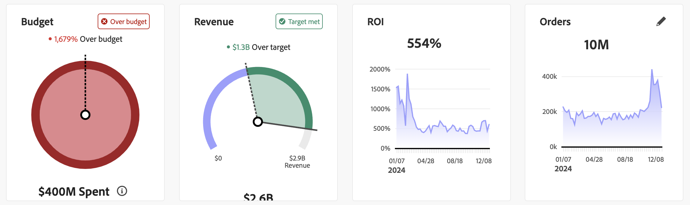
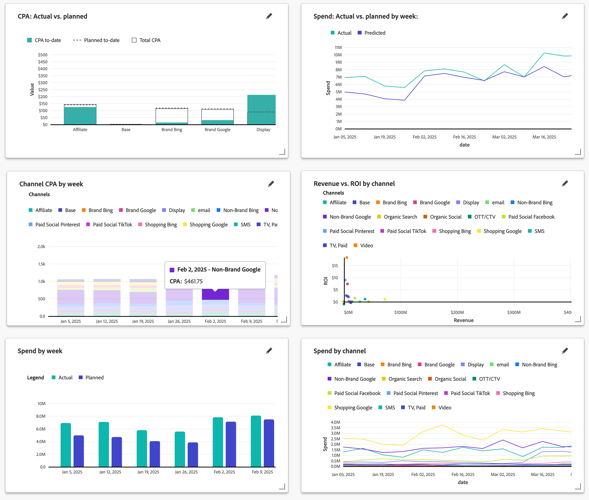

# パフォーマンスからプランへ

>[!NOTE]
>
>Mix Modeler  **[!UICONTROL Overview]**&#x200B;の「**[!UICONTROL Performance to plan]** [!BADGE Beta]{type=Informative}」タブはベータ機能であり、その機能は変更される可能性があります。 この機能は、限られた数のお客様にご利用いただけます。

Mix Modeler  **[!UICONTROL Overview]**&#x200B;の&#x200B;**[!UICONTROL Plans]** [!BADGE Beta]{type=Informative} タブには、計画に対するマーケティングのパフォーマンスを監視するためのトラッキングダッシュボードが用意されています。 ステータスカードとビジュアライゼーション機能を利用して、実際のパフォーマンスと計画されたパフォーマンスを追跡することができます。

ダッシュボードは、ギャップを特定し、リスクや機会を特定し、計画や予算をタイムリーに調整するのに役立ちます。

KPI ステータス カードとビジュアライゼーションに表示されるデータを選択するには：

* **[!UICONTROL _オプションを選択…_]**&#x200B;を使用して、**[!UICONTROL Plan name]** ドロップダウンメニューからプランを選択します。

* 日付期間を指定します。 日付期間を変更するには、開始日と終了日を手動で入力するか、を使用して日付期間を選択します。

「**[!UICONTROL Plans]** [!BADGE Beta]{type=Informative}」タブには、次の情報が表示されます。

* [KPI ステータスカード ](#kpi-status-cards):

   * [予算](#budget)
   * [売上高](#revenue)
   * [ROI](#roi)
   * [KPI](#kpi)

* [ ビジュアライゼーション ](#visualizations):
   * [*指標*：実際の指標と計画された指標の比較](#metric-actual-vs-planned)
   * [*指標*：実際の指標と&#x200B;*精度*&#x200B;で計画された指標の比較](#metric-actual-vs-planned-by-granularity)
   * [チャネル *指標* by *精度*](#channel-metric-by-granularity)
   * [チャネル別&#x200B;*指標*&#x200B;対&#x200B;*指標*](#metric-vs-metric-by-channel)
   * [*粒度*&#x200B;による&#x200B;*指標*](#metric-by-granularity)
   * [チャネル別&#x200B;*指標*](#metric-by-channel)

## KPI ステータスカード

### 予算

マーケティング費用と日付期間の計画の予算との比較を表示する、循環進行状況のビジュアライゼーション。

### 売上高

日付期間の計画された目標収益と実際の収益の比較を表示する循環進行状況のビジュアライゼーション。

### ROI

日付期間のROIを表示する行の可視化。

### KPI

日付期間のKPIを表示する行の可視化。

別のKPIを選択するには：

1. を選択します。
1. **[!UICONTROL KPI status card]** ダイアログで、**[!UICONTROL KPI]** ドロップダウンメニューからKPIを選択します。 利用できるオプションは、[!UICONTROL Conversions]、[!UICONTROL CPA]、[!UICONTROL Revenue]、[!UICONTROL ROI]および[!UICONTROL Spend]です。

## ビジュアライゼーション

6つのビジュアライゼーションを使用でき、6つのビジュアライゼーションのそれぞれを編集できます。

ビジュアライゼーションのサイズを変更するには、右下隅の┛ ハンドルを使用します。 ビジュアライゼーションを移動するには、ビジュアライゼーションを目的の位置にドラッグ&amp;ドロップするだけです。

ビジュアライゼーションの任意の行、棒グラフまたは散布要素にカーソルを合わせると、追加情報を含むポップアップが表示されます。

### *指標*：実際の指標と計画された指標の比較

選択した指標の値を日付、予定日、合計と比較する積み上げ棒グラフのビジュアライゼーション。

### *指標*：実際の指標と&#x200B;*精度*&#x200B;で計画された指標の比較

選択した指標と選択した粒度の実際の値と計画された値を表示する折れ線ビジュアライゼーション。

### チャネル *指標* by *精度*

選択した指標と選択した粒度のチャネルを表示する積み重ね棒を表示する積み重ね棒ビジュアライゼーション。

### チャネル別&#x200B;*指標*&#x200B;対&#x200B;*指標*

選択した指標のチャネルの散布図を表示する散布図のビジュアライゼーション。

### *粒度*&#x200B;による&#x200B;*指標*

選択した指標の実際の値と計画された値を表示する棒グラフのビジュアライゼーション。

### チャネル別&#x200B;*指標*

選択した粒度に対して選択した指標を表示する複数行のビジュアライゼーション。

### ビジュアライゼーションの編集

ビジュアライゼーションを編集するには：

1. 「」を選択して、**[!UICONTROL Edit data]** ダイアログを開きます。
1. ビジュアライゼーションに応じて、以下を変更できます。

   * 1つまたは2つの指標：**[!UICONTROL Select metric]** ドロップダウンメニューから指標を選択します。

      * ROI ベースのプランの場合、オプションは[!UICONTROL Conversions]、[!UICONTROL CPA]、[!UICONTROL Revenue]、[!UICONTROL ROI]、[!UICONTROL Spend]および[!UICONTROL Volume]です。
      * CPA ベースのプランの場合、オプションは[!UICONTROL Conversions]、[!UICONTROL CPA]、[!UICONTROL Spend]、および[!UICONTROL Volume]です。
   * **[!UICONTROL Granularity]**: **[!UICONTROL Granularity]** ドロップダウンメニューから&#x200B;**[!UICONTROL date ranges]**&#x200B;または&#x200B;**[!UICONTROL week]**&#x200B;のいずれかを選択します。

   **[!UICONTROL Preview]**&#x200B;で、変更が&#x200B;**[!UICONTROL Current]** ビジュアライゼーションとどのように異なるかがわかります。

1. **[!UICONTROL Apply]**&#x200B;を選択して変更を適用します。 ビジュアライゼーションの変更をキャンセルするには、**[!UICONTROL Cancel]**&#x200B;を選択します。
