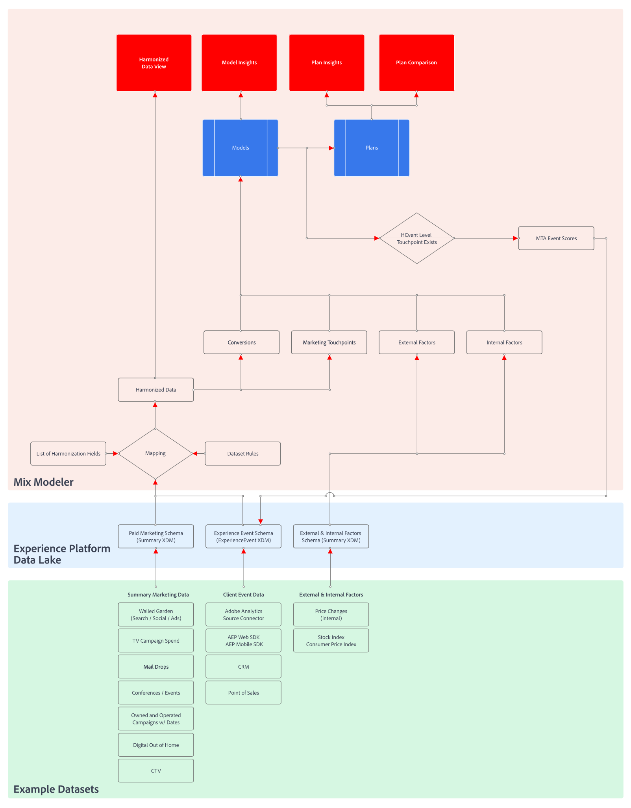

# Mix Modelerワークフロー

Mix Modelerのユーザーワークフローの概要については、このビデオを参照してください。

>[!VIDEO](https://video.tv.adobe.com/v/3424854/?learn=on)

Mix Modelerの一般的なワークフローは、次のアクティビティで構成されます。

|  | アクティビティ | 説明 |
|---|---|---|
| {width="100"} | [**データの取得**](../ingest-data/overview.md) | Experience Platform( 例：Adobe Analytics、Web SDK、その他のソース ) からのイベントデータの取り込み、マーケティングチャネルからの集計データ（例：TV、ウォールガーデン、E メール、所有および操作済みのアクティビティ）、顧客からの外部要因データ（例：購読サービスの価格変更）。 |
| {width="100"} | [**データを調和させる**](../harmonize-data/overview.md) | マッピングルールと競合解決ルールを設定し、Mix Modelerでキャンペーンのパフォーマンスを測定し計画するために必要な様々なマーケティングデータセットを結合します。 |
| {width="100"} | [**モデルの設定**](../models/create.md) | マーケティングタッチポイント（例えば、チャネル）、コンバージョンの定義、内部および外部要因を使用して、モデルインスタンスを設定します。 |
| {width="100"} | [**モデルのトレーニングとスコアリング**](../models/overview.md) | 機械学習のトレーニングとスコアリングを使用して、集計とイベントレベルのスコアを作成します。 |
| {width="100"} | [**プランの作成**](../plans/overview.md) | Mix Modelerのモデルの出力を使用して、ビジネス目標を達成するためのマーケティング資金の最適な配分を決定します。 |
| {width="100"} | [**概要ダッシュボード**](../dashboard/overview.md) | 様々な設定可能なウィジェットを使用して、調和されたデータ、モデル、プランに関するインサイトを得ます。 |

{style="table-layout:auto"}

以下に示す詳細なデータ指向フローチャートは、次の点を示しています。

* 調整済みのデータは、次の条件に基づいています。

   * エクスペリエンスイベントデータ (Analytics ソースコネクタから取得され、Experience PlatformSDK および API を通じて収集され、ソースコネクタを通じて取得される、またはストリーミング取得を使用して取得される )
   * ウォールガーデン (Facebook、YouTubeなど )、トラフィックソース、オフライン広告データからの集計データまたは概要データ
   * 調和されたフィールドとデータセットルールの定義。

* モデルは、次のものに基づいています。

   * 調和されたデータと
   * 内部または外部要因を含む、マーケティング以外の集計または概要データ。

* マルチタッチアトリビューションのイベントスコアは、後続のモデル設定、トレーニング、スコアリングで使用するために、Experience Platformデータレイクにフィードバックされる可能性があります。

