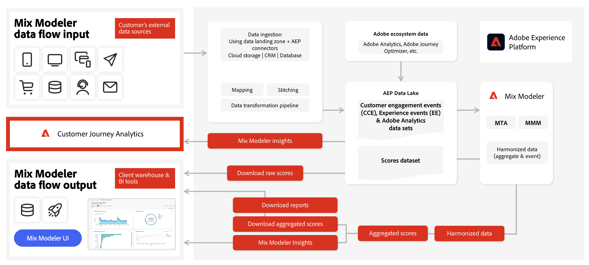

# Mix Modeler ワークフロー

Mix Modelerのユーザーワークフローの概要については、このビデオを参照してください。

>[!VIDEO](https://video.tv.adobe.com/v/3424854/?learn=on)

Mix Modelerの一般的なワークフローは、次のアクティビティで構成されます。

|  | Activity | 説明 |
|---|---|---|
| {width="100"} | [**データの取り込み**](../ingest-data/overview.md) | Experience Platformからのイベントデータ（Adobe Analytics、Web SDK、その他のソースなど）、マーケティングチャネルからの集計データ（テレビ、壁庭、メール、所有および運営アクティビティなど）、顧客からの外部要因データ（購読サービスの価格変化など）、内部要因データ（休暇プランなど）を取り込みます。 |
| {width="100"} | [**データのハーモナイズ**](../harmonize-data/overview.md) | マッピングルールと競合解決ルールを設定して、Mix Modelerでキャンペーンのパフォーマンスを測定および計画するために必要な様々なマーケティングデータセットを結合します。 |
| {width="100"} | [**モデルの作成**](../models/overview.md) | マーケティングタッチポイント（チャネルなど）、コンバージョン定義、内部要因および外部要因を持つモデルインスタンスを作成します。 |
| {width="100"} | [**モデルのトレーニングとスコアリング**](../models/overview.md) | 機械学習のトレーニングとスコアリングを使用して、集計レベルとイベントレベルのスコアを作成します。 |
| {width="100"} | [**プランの作成**](../plans/overview.md) | プランを作成および作成します。 Mix Modeler モデルの出力を使用して、ビジネス目標を達成するためのマーケティング資金の最適な配分を決定します。 |
| {width="100"} | [**概要ダッシュボード**](../dashboard/overview.md) | 様々な設定可能なビジュアライゼーションを使用して、統一されたデータ、モデルおよびプランに関するインサイトを取得します。 |

{style="table-layout:auto"}

入力データがMix Modelerにどのように流れ込むか、およびMix Modelerが独自のインターフェイスだけでなく、Customer Journey Analyticsなどの他のソリューションの出力データを生成する方法の概要を以下に示します。

<!---
The detailed data-oriented flowchart below illustrates how:

* harmonized data is based on:

  * experience event data (originating from Analytics source connector, collected through Experience Platform SDKs and APIs, ingested through source connectors, or using streaming ingestion),
  * aggregate or summary data from walled gardens (like Facebook, YouTube), traffic sources, or offline advertising data, and 
  * definitions of harmonized fields and dataset rules.

* a model is based on:

  * the conversion and marketing touchpoint definitions resulting from the harmonized data and 
  * non-marketing aggregate or summary data containing internal or external factors.

* mult-touch attribution event scores can potentially be fed back into Experience Platform data lake for use in subsequent model configuration, training and scoring.

-->
