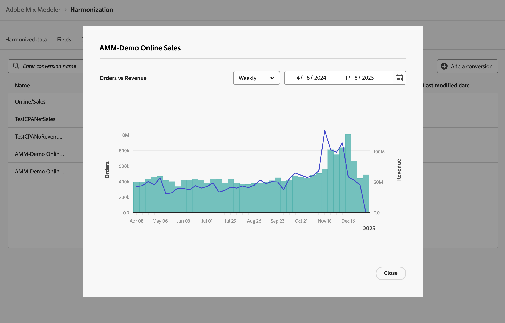

# コンバージョン数 {#conversions}

>[!CONTEXTUALHELP]
>id="harmonizeddata_conversions_create"
>title="変換"
>abstract="コンバージョンイベントは、マーケティングアクティビティの影響を識別するビジネス目標です。 例：e コマースの注文、店舗での購入、web サイトへの訪問など。"

コンバージョンイベントは、マーケティングアクティビティの影響を識別するビジネス目標です。 例：コマース注文、実店舗での購入、web サイトへの訪問など

アトリビューション分析用にマーケティングコンバージョンを定義します。

## コンバージョンの管理

使用可能なコンバージョンの表を表示するには、Mix Modeler インターフェイスで次の操作を行います。

1. 左側のパネルから「 **[!UICONTROL Harmonized data]**」を選択します。

1. 上部バーから&#x200B;**[!UICONTROL Conversions]**&#x200B;を選択します。 コンバージョンのテーブルが表示されます。

表の列には、変換に関する詳細が示されます。

| 列の名前 | 詳細 |
| --- | ---|
| 名前 | コンバージョンの名前。 |
| 売上高 | コンバージョンからの収益を計算するために使用する調和されたデータ指標。 |
| コンバージョン指標 | 分析の変換指標として使用する調和データ指標。 |
| カテゴリ | コンバージョンのコンバージョンカテゴリ。 |
| 作成日時 | コンバージョンの作成日時。 |
| 最終変更日 | コンバージョンの最後の変更の日時。 |

## コンバージョンの追加

コンバージョンを追加するには、Mix Modelerの **[!UICONTROL Harmonized data]** > **[!UICONTROL Conversion]** インターフェイスで次の操作を行います。

1. 「 **[!UICONTROL Add a conversion]**」を選択します。

1. **[!UICONTROL Create conversion]** ダイアログで、次の操作を行います。

   1. **[!UICONTROL Conversion]**&#x200B;の名前（例：`Store Conversions`）を入力してください。

   1. **[!UICONTROL Conversion category]**&#x200B;を定義します。

      1. **[!UICONTROL *調和を選択…*]**&#x200B;から値を選択します（例：`Conversion types`）。

      1. 演算子の値（例：**[!UICONTROL is]**）を選択します。

      1. **[!UICONTROL *値&#x200B;*]**&#x200B;から値を選択するか、値（例：**[!UICONTROL Store]**）を入力します。

   1. **[!UICONTROL Conversion metric for analysis]**&#x200B;から調和されたフィールド （例：**[!UICONTROL Orders]**）を選択します。

   1. **[!UICONTROL Revenue field]**&#x200B;から調和されたフィールド （例：**[!UICONTROL Gross Demand]**）を選択します。

   1. コンバージョンを作成するには、**[!UICONTROL Create]**&#x200B;を選択します。 コンバージョンの作成をキャンセルするには、**[!UICONTROL Cancel]**&#x200B;を選択します。

      

1. 作成すると、コンバージョンがコンバージョンテーブルに追加されます。

## 詳細を表示

コンバージョンの詳細を表示するには、次の手順に従います。

1. テーブル内のコンバージョン名にカーソルを合わせると、を選択します。

1.  **詳細を表示**&#x200B;を選択します。 ダイアログにコンバージョンの詳細が表示されます。 詳しくは、[&#x200B; コンバージョンの追加](#add-a-conversion)を参照してください。 ダイアログを閉じるには、**[!UICONTROL Cancel]**&#x200B;を選択します。

## レポートを読む

コンバージョンのレポートを表示するには：

1. テーブル内のコンバージョン名にカーソルを合わせると、を選択します。

1. 「 **レポートを表示**」を選択します。 ダイアログには、コンバージョンのレポートが表示されます。

   

   * レポートする精度を変更するには、**[!UICONTROL Weekly]** ドロップダウンメニューから値を選択します。
   * レポートする期間を変更するには、開始日と終了日を入力するか、を使用してカレンダーのポップアップで期間を定義します。

1. ダイアログを閉じるには、**[!UICONTROL Close]**&#x200B;を選択します。

## コンバージョンの削除

コンバージョンを削除するには：

1. テーブルのコンバージョン名にカーソルを合わせると、 **削除**&#x200B;を選択します。
1. **[!UICONTROL Delete conversion]** ダイアログの確認ダイアログで、**[!UICONTROL Delete]**&#x200B;を選択してコンバージョンを完全に削除します。
