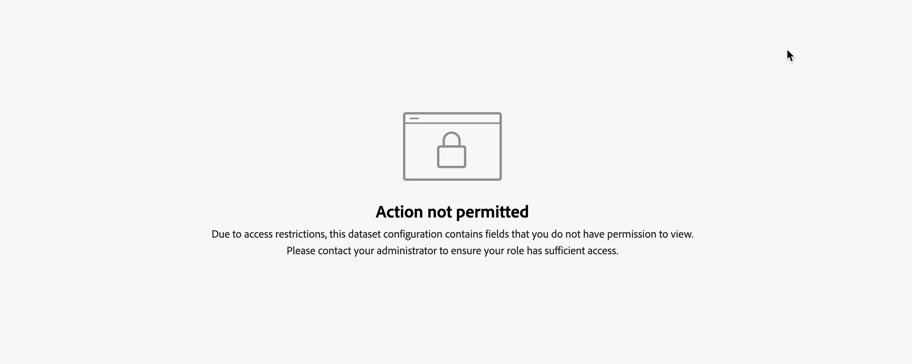

# データセットルール

データセットルールは、統一されたフィールドを、Mix Modelerに取り込んだデータのフィールドとマッピングする際に役立ちます。

* Adobe Experience Platformに取り込んだ集計データについて、1 つ以上の使用可能なデータセットフィールドを適切な統一されたフィールドにマッピングします。
* イベントデータの場合は、1 つ以上の統一されたフィールドを、直接または条件を使用して、データセットのフィールドに個別にマッピングできます。

## データセットルールの管理

Mix Modelerインターフェイスで使用可能なデータセットルールのテーブルを表示するには、次の手順を実行します。

1. を選択  **[!UICONTROL Harmonized data]** 左パネルから。

1. を選択 **[!UICONTROL Dataset rules]** 上部バーから。 データセットルールのテーブルが表示されます。

テーブルの列には、データセットルールの詳細が表示されます。

| 列名 | 詳細 |
| ---------------------- | ----------|
| データセット | データセットの名前。 |
| ソース | データセットのソース：Adobe Analytics、エクスペリエンスイベント、概要（集計）またはコンシューマーエクスペリエンスイベント。 |
| スキーマ | データセットが準拠するスキーマ。 スキーマ名をすばやく選択して、のスキーマエディターの新しいタブでスキーマを開くことができます  [スキーマ](../ingest-data/schemas.md). |
| 精度 | データセット内のデータの精度。 指定可能な値は、Daily、Weekly、Monthly、Yearly です。 |
| 週の開始日 | 特定のデータセットについて、新しい週の開始日と見なされる曜日を指定します。 |
| ステータス | フィールドのステータス： 
● ドラフトまたは 
● アクティブ |
| 最終変更日 | データセットルールの最終変更日時。 |

{style="table-layout:auto"}

### データセットルールの作成

データセットルールを作成するには、  **[!UICONTROL Harmonized data]** > **[!UICONTROL Dataset rules]** Mix Modelerのインターフェイスで、を選択します **[!UICONTROL Create a dataset rule]** が含まれる **[!UICONTROL Dataset rules configuration]** ウィザード。

が含まれる **[!UICONTROL Create]** 画面、

1. 対象： **[!UICONTROL Dataset details]**&#x200B;からデータセットを選択します **[!UICONTROL Select dataset]** 設定を開始します。 リストでは、データセットは次のように分類されます **[!UICONTROL Consumer Experience Events]**, **[!UICONTROL Adobe Analytics]**, **[!UICONTROL Experience Event]** また、 **[!UICONTROL Summary]**.

1. 次の期間の日を選択： **[!UICONTROL Start of the week]**.

1. を選択 **[!UICONTROL Daily]**, **[!UICONTROL Weekly]**, **[!UICONTROL Monthly]** または **[!UICONTROL Yearly]** （用） **[!UICONTROL Granularity]**.

1. のデータセットを選択した場合 **[!UICONTROL Summary]** カテゴリ：

   1. データセットのデータを集計するか、既存のデータを置き換えるかを定義するには、次を選択します **[!UICONTROL Aggregation]** または **[!UICONTROL Replacement]** （用） **[!UICONTROL Data restatement is by]**.

   1. 各の **[!UICONTROL Available dataset fields]** 対応する **[!UICONTROL Standard harmonized fields]** 。対象： **[!UICONTROL Map to harmonized fields]**. データセットフィールドを統一フィールドにマッピングしない場合は、を明示的に選択します **[!UICONTROL -- None --]**.

   1. リストから利用できない新しい統一フィールドが必要な場合は、次を選択します **[!UICONTROL Create New]** 新しい統一フィールドを作成します。 ダイアログは、で説明されているように表示されます。 [新しい統一フィールドを追加](fields.md#add-a-harmonized-field).

   1. ルールのすべてのフィールドに対してマッピングが完了したら、 **[!UICONTROL Save as draft]** ルールのドラフトバージョンを保存する場合、または **[!UICONTROL Save]** ルールを保存してアクティブにします。 を選択 **[!UICONTROL Cancel]** をクリックして、ルール設定をキャンセルします。

      

1. イベントカテゴリデータセット（**[!UICONTROL Experience Events]**, **[!UICONTROL Adobe Analytics]**, **[!UICONTROL Consumer Experience Events]**）、の下のボックス **[!UICONTROL Map to harmonized fields]**:

   1. から統一フィールドを選択 **[!UICONTROL Standard harmonized field]**.

   1. 選択した統一フィールドが指標タイプの場合：

      1. を選択 **[!UICONTROL Count]** または **[!UICONTROL Sum]** から **[!UICONTROL Mapping type]**.

      1. を選択 **[!UICONTROL *AEP データセットフィールド&#x200B;*]**統一フィールドをデフォルトでマッピングする宛先。

   1. 選択したフィールドのタイプがディメンションの場合：

      1. を選択 **[!UICONTROL Map Into]** または **[!UICONTROL Case]** から **[!UICONTROL Mapping type]**.

      1. を選択した場合 **[!UICONTROL Map Into]**&#x200B;を選択 **[!UICONTROL Field]** および **[!UICONTROL *AEP データセットフィールド&#x200B;*]**または&#x200B;**[!UICONTROL Value]**統一フィールドをデフォルトでデータセットフィールドまたは入力された値にマッピングするためのデフォルト値。

      1. 選択した場合 **[!UICONTROL Case]**&#x200B;を選択 **[!UICONTROL Field]** および **[!UICONTROL *AEP データセットフィールド&#x200B;*]**または&#x200B;**[!UICONTROL Value]**統一フィールドをデフォルトでデータセットフィールドまたは入力された値にマッピングするためのデフォルト値。

         1. 値を明示的に設定するには、1 つ以上の条件で構成される 1 つ以上のケースを定義します。 各条件は、特定のを確認できます **[!UICONTROL *AEP データセットフィールド&#x200B;*]**かどうか&#x200B;**[!UICONTROL Exists]**または&#x200B;**[!UICONTROL Not Exists]**またはかどうか&#x200B;**[!UICONTROL Contains]**,**[!UICONTROL Not Contains]**,**[!UICONTROL Equals]**,**[!UICONTROL Not Equals]**,**[!UICONTROL Starts With]**、または&#x200B;**[!UICONTROL Ends With]**に入力された値**[!UICONTROL *&#x200B;入力値を入力&#x200B;*]**.

         1. 別のケースを追加するには、を選択します  **[!UICONTROL Add case]**&#x200B;で別の条件を追加するには、次を選択します  **[!UICONTROL Add condition]**.

         1. ケースまたは条件を削除するには、  対応するコンテナ内。

         1. 条件の一部または全部をケースに適用するかどうかを選択するには、 **[!UICONTROL Any of]** または **[!UICONTROL All of]**.

         1. ケースの結果値を設定するには、次の場所に値を入力します： **[!UICONTROL Then]**.

      以下の例

      * はを使用します **[!UICONTROL Map Into]** **[!UICONTROL Mapping type]** をマッピングします **[!UICONTROL Channel Type At Source]** 統一フィールドを **[!UICONTROL channel_type]** からのフィールド **[!DNL Luma Transactions]** データセット。

      * はを使用します **[!UICONTROL Case]** **[!UICONTROL Mapping type]** の値を条件付きでマッピングするには： **[!UICONTROL marketing.campaignName]** のフィールド **[!DNL Luma Transactions]** データセットをに **[!UICONTROL Campaign]** 統一フィールド。 Campaign 統一フィールドは次のように設定されます。

         * `Black Friday` いつ **[!UICONTROL marketing.campaignName]** 等しい `_black_friday` または `BlackFriday`.
         * の値に **[!UICONTROL marketing.campaignName]** それ以外の場合は。

        

1. を選択  **[!UICONTROL Add field]** 追加のフィールドを定義します。

終了したら、 **[!UICONTROL Save as draft]** ルールのドラフトバージョンを保存する場合、または **[!UICONTROL Save]** ルールを保存してアクティブにします。 を選択 **[!UICONTROL Cancel]** をクリックして、ルール設定をキャンセルします。

### データセットルールの編集

データセットルールを編集するには、  **[!UICONTROL Harmonized data]** > **[!UICONTROL Dataset rules]** Mix Modelerのインターフェイス：

1. を選択  が含まれる **[!UICONTROL Dataset]** 編集するデータセットルールの列。
1. コンテキストメニューから、  **[!UICONTROL Edit]** データセットルールの編集を開始します。 こちらを参照してください [データセットルールの作成](#create-a-dataset-rule) を参照してください。

### データセットルールの削除

データセットルールを削除するには、で  **[!UICONTROL Harmonized data]** > **[!UICONTROL Dataset rules]** Mix Modelerのインターフェイス：

1. を選択  が含まれる **[!UICONTROL Dataset]** 削除するデータセットルールの列。
1. コンテキストメニューから、  **[!UICONTROL Delete]** データセットルールを削除します。 確認を求めるプロンプトが表示されます。 を選択 **[!UICONTROL Delete]** 選択したデータセットルールを完全に削除します。

## データを同期

統一データと概要データセットやイベントデータセットの間でデータを同期するには、データセットルール内のすべてのロジックに従います。

1. **[!UICONTROL Sync data]** を選択します。

1. から **[!UICONTROL Sync data for dataset rules]** ダイアログ、のいずれかを選択
   * **[!UICONTROL Refresh harmonized data for summary datasets]**,
   * **[!UICONTROL Refresh harmonized data for event datasets]**、または
   * **[!UICONTROL Refresh harmonized data for both summary + event datasets]**。

1. 統一データとデータセット内のデータの間に定義されたデータセットルールに基づいて同期を開始するには、以下を選択します **[!UICONTROL Sync]**. 同期をキャンセルするには、以下を選択します **[!UICONTROL Cancel]**.

   

## データ結合環境設定

>[!NOTE]
>
>[!BADGE Beta]{type=Informative}

データ結合の環境設定は、要約されたデータソースとイベントデータソースのデータが結合される際の競合の解決に役立ちます。 ユースケースは次のとおりです。

* 同じ広告指標が複数のデータセットで測定およびレポートされる
* 一部のデータセットでは指標の測定が不完全な場合がありますが、別のデータセットは特定の指標のスーパーセットである場合があり、二重カウントが発生する可能性があります。

モデルを正確に予測するために、以下の方法でデータ結合の環境設定を定義できます。

1. を選択  [!BADGE ベータ] **データ結合環境設定**.

1. が含まれる **[!UICONTROL Data merge preferences]** ダイアログ：

   

   * を選択 **[!UICONTROL Default metric preference]**. 選択したデフォルトの指標の環境設定は、ハーモナイゼーション中に、複数のデータソースが特定のチャネルの指標フィールドを更新すると適用されます。 特定の指標ベースの環境設定で上書きされない限り、環境設定はサンドボックスレベルで適用されます。

   * 特定の指標ベースの環境設定を追加するには：

      1. を選択  **[!UICONTROL Add a metric]**.
         1. から指標を選択 **[!UICONTROL *指標の選択&#x200B;*]**リスト。
         1. **[!UICONTROL CHANNELS]** または **[!UICONTROL CONVERSION TYPES]** を選択します。リストで「」を選択します。 **[!UICONTROL All]** または特定のチャネルやコンバージョンタイプです。
         1. を選択 **[!UICONTROL Summary]** または **[!UICONTROL Event]** データを結合する際に、指標（およびすべてのチャネルまたは選択したチャネル）に対して概要データまたはイベントデータを優先するかどうかを指定します。

1 つ以上のチャネルまたはコンバージョンタイプを追加するには：

         1. を選択  **[!UICONTROL Add a channel]** または  **[!UICONTROL Add a conversion type]**.
         1. **[!UICONTROL Summary]** または **[!UICONTROL Event]** を選択します。

チャネルまたはコンバージョンタイプを削除するには： select .

      1. 指標に基づいた環境設定をさらに具体的に追加するには、前の手順を繰り返します。

   * 既存の特定の指標に基づく環境設定を削除するには、以下を選択します .

1. を選択 **[!UICONTROL Save]** データ結合の環境設定を保存します。 データの再同期が開始されます。  を選択 **[!UICONTROL Cancel]** をキャンセルします。

## フィールドレベルのアクセス制御

統一データセットのデータセットルールを設定する場合、Experience Platform [属性ベースのアクセス制御](https://experienceleague.adobe.com/en/docs/experience-platform/access-control/abac/overview) はフィールドレベルで適用されます。 ラベルがスキーマフィールドに添付され、そのフィールドへのアクセスを拒否するアクティブなポリシーが有効になっている場合、フィールドは制限されます。 その結果、次のようになります。

* データセットルールを作成する際に、制限されているスキーマフィールドが表示されません。
* 自身に対して制限されている 1 つ以上のスキーマフィールドのマッピングを表示または編集できません。 このような制限されたフィールドを含むデータセットルールを編集または表示すると、次の画面が表示されます。
  
