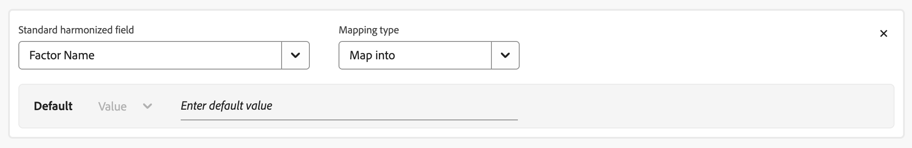
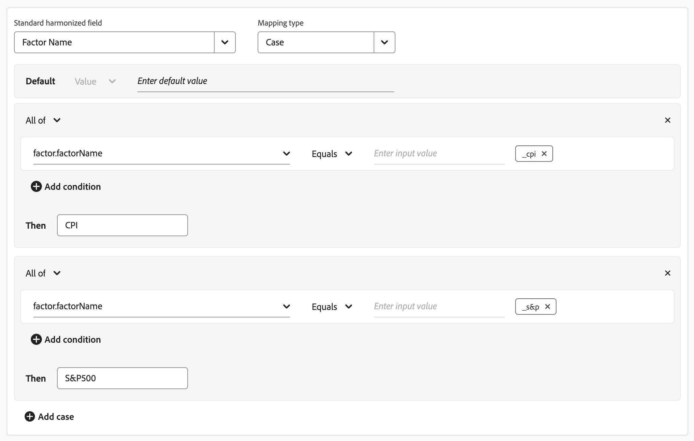

# データセットルール

データセットルールは、Mix Modelerで取り込んだデータのフィールドと調和フィールドのマッピングに役立ちます。

* Adobe Experience Platformに取り込んだ集計データの場合、使用可能なデータセットフィールドの1つ以上を、適切な調和フィールドにマッピングします。
* イベントデータの場合、1つ以上の調和されたフィールドをデータセットのフィールドに個別にマッピングしたり、直接条件を使用したりできます。

## データセットルールの管理

使用可能なデータセットルールのテーブルを表示するには、Mix Modeler インターフェイスで次の操作を行います。

1. 左側のパネルから「 **[!UICONTROL Harmonized data]**」を選択します。

1. 上部バーから&#x200B;**[!UICONTROL Dataset rules]**&#x200B;を選択します。 データセットルールのテーブルが表示されます。

 **[!UICONTROL _データセット名_]**&#x200B;を入力すると、データセットをすばやく検索できます。

テーブル列には、データセットルールに関する詳細が指定されます。

| 列の名前 | 詳細 |
| ---------------------- | ----------|
| **[!UICONTROL Dataset]** | データセットの名前。  データセットのアクションを選択するには、を使用します。 実行できる操作は、次のとおりです。<ul><li> **[!UICONTROL View]**&#x200B;して、データセット ルール設定を表示します。 すべてのフィールドが無効になっています。</li><li> **[!UICONTROL Edit]**&#x200B;して、データセット ルール設定を編集します。</li><li> **[!UICONTROL Delete]**&#x200B;して、データセット ルール設定を削除します。 データセットを削除ダイアログで削除を確認するように求められます。 データセット ルール設定を完全に削除するには、**[!UICONTROL Delete]**&#x200B;を選択します。</li><ul> |
| **[!UICONTROL Source]** | データセットのソース：Adobe Analytics、Experience Events、Summary （集計）、またはConsumer Experience Events。 |
| **[!UICONTROL Schema]** | データセットが準拠するスキーマ。 スキーマ名をすばやく選択して、 [&#x200B; スキーマ &#x200B;](../ingest-data/schemas.md)のスキーマエディターの新しいタブでスキーマを開くことができます。 |
| **[!UICONTROL Granularity]** | データセット内のデータの精度： 指定できる値は、日単位、週単位、月単位または年単位です。 |
| **[!UICONTROL Start of the week]** | 特定のデータセットに対して、新しい週の開始と見なされる曜日を指定します。 |
| **[!UICONTROL Status]** | フィールドのステータス： Draftまたは Active |
| **[!UICONTROL Last modified]** | データセットルールの最後の変更のデータと時刻。 |

{style="table-layout:auto"}

### データセットルールの作成

データセットルールを作成するには、Mix Modelerの **[!UICONTROL Harmonized data]** > **[!UICONTROL Dataset rules]** インターフェイスで、**[!UICONTROL Dataset rules configuration]** ウィザードの&#x200B;**[!UICONTROL Create a dataset rule]**&#x200B;を選択します。

**[!UICONTROL Create]**&#x200B;画面では，

1. **[!UICONTROL Dataset details]**&#x200B;で、**[!UICONTROL Select dataset]**&#x200B;からデータセットを選択して設定を開始します。 リストでは、データセットは&#x200B;**[!UICONTROL Summary]**、**[!UICONTROL Adobe Analytics]**、**[!UICONTROL Experience Event]**、**[!UICONTROL Factors]**&#x200B;および&#x200B;**[!UICONTROL Consumer Experience Events]**&#x200B;に分類されています。

1. **[!UICONTROL Start of the week]**&#x200B;の日付を選択してください。

1. **[!UICONTROL Granularity]**&#x200B;の&#x200B;**[!UICONTROL Daily]**、**[!UICONTROL Weekly]**、**[!UICONTROL Monthly]**&#x200B;または&#x200B;**[!UICONTROL Yearly]**&#x200B;を選択してください。

1. **[!UICONTROL Summary]**&#x200B;または&#x200B;**[!UICONTROL Factors]** カテゴリのデータセットを選択したら、**[!UICONTROL Data restatement is by]**&#x200B;の&#x200B;**[!UICONTROL Aggregation]**&#x200B;または&#x200B;**[!UICONTROL Replacement]**&#x200B;を選択します。

   メディア企業との取引は、多額の費用を要することが多く、レポートデータを変更すると、インサイトや投資計画が大きく異なることがあるため、メディア企業からのレポートデータはマーケティングアナリストにとって非常に重要です。 さらに、マーケティングアナリストは、関係者の信頼を得るために、適切なインサイトを導き出し、説得力のある提案を提示するための正確なデータを必要としています。 しかし、GoogleやFacebookなどのメディアは、データを紐付ける際に、レポートデータを再利用したり削除したりすることがよくあります。 ほとんどの変更の期間は、報告されたメディアパフォーマンスから7日以内です。 データの変更は30日以内に可能です。 一般的に、30日後、本は閉じられ、データは完全と見なされます。

   Mix Modelerは、データの再表示をサポートしています。 レポート、モデリング、計画に使用するデータが正確であることを確認する必要があります。 データがマーケティングアナリストの期待とニーズをサポートすること。

   Experience Platform データセット内の増分行として再表示された概要データを送信できます。また、調和サービスは、その再表示されたデータで調和されたデータセットを更新します。 同様に、調和サービスに反映する必要がある概要データの行を削除することもできます。

1. **[!UICONTROL Map to harmonized fields]** セクションで、**[!UICONTROL Standard harmonized field]**&#x200B;から調和フィールドを選択します。 [調整された新しいフィールドをすばやく作成するには](/help/harmonize-data/fields.md#add-a-harmonized-field)を選択します。**[!UICONTROL Create new]**

   * 選択した調和フィールドが指標タイプの場合：

      1. **[!UICONTROL Mapping type]**&#x200B;から&#x200B;**[!UICONTROL Count]**&#x200B;または&#x200B;**[!UICONTROL Sum]**&#x200B;を選択します。

      1. 調和フィールドをデフォルトでマッピングする&#x200B;**[!UICONTROL *AEP データセットフィールド&#x200B;*]**&#x200B;を選択します。

   * 選択したフィールドがディメンション タイプの場合：

      1. **[!UICONTROL Mapping type]**&#x200B;から&#x200B;**[!UICONTROL Map Into]**&#x200B;または&#x200B;**[!UICONTROL Case]**&#x200B;を選択します。

      1. **[!UICONTROL Map Into]**&#x200B;を選択したら、**[!UICONTROL Field]**&#x200B;と&#x200B;**[!UICONTROL *AEP データセットフィールド&#x200B;*]**&#x200B;または&#x200B;**[!UICONTROL Value]**&#x200B;を選択し、デフォルト値を指定して、調整フィールドをデータセットフィールドまたは入力された値にマッピングします。

      1. **[!UICONTROL Case]**&#x200B;を選択すると、**[!UICONTROL Field]**&#x200B;と&#x200B;**[!UICONTROL *AEP データセットフィールド&#x200B;*]**&#x200B;または&#x200B;**[!UICONTROL Value]**&#x200B;を選択し、デフォルト値を指定して、調整フィールドをデータセットフィールドまたは入力された値にマッピングします。

         1. 値を明示的に設定するには、1つ以上の条件で構成される1つ以上のケースを定義します。 各条件は、特定の&#x200B;**[!UICONTROL *AEP データセットフィールド&#x200B;*]**&#x200B;について、**[!UICONTROL Exists]**&#x200B;または&#x200B;**[!UICONTROL Not Exists]**&#x200B;かどうか、または&#x200B;**[!UICONTROL Contains]**、**[!UICONTROL Not Contains]**、**[!UICONTROL Equals]**、**[!UICONTROL Not Equals]**、**[!UICONTROL Starts With]**&#x200B;または&#x200B;**[!UICONTROL Ends With]**&#x200B;が&#x200B;**[!UICONTROL *&#x200B;入力値&#x200B;*]**&#x200B;に入力された値かどうかを確認できます。

         1. 別のケースを追加するには、 **[!UICONTROL Add case]**&#x200B;を選択し、別の条件を追加するには、 **[!UICONTROL Add condition]**&#x200B;を選択します。

         1. ケースまたは条件を削除するには、対応するコンテナでを選択します。

         1. ケースに適用する条件をすべて選択するには、**[!UICONTROL Any of]**&#x200B;または&#x200B;**[!UICONTROL All of]**&#x200B;を選択します。

         1. ケースの結果値を設定するには、値を&#x200B;**[!UICONTROL Then]**&#x200B;に入力します。

     次の例を示します。

      * **[!UICONTROL Map Into]** **[!UICONTROL Mapping type]**&#x200B;を使用して、調和された&#x200B;**[!UICONTROL Channel Type At Source]** フィールドを&#x200B;**[!DNL Luma Transactions]** データセットの&#x200B;**[!UICONTROL channel_type]** フィールドにマッピングします。

      * **[!UICONTROL Case]** **[!UICONTROL Mapping type]**&#x200B;を使用して、条件付きで&#x200B;**[!DNL Luma Transactions]** データセットの&#x200B;**[!UICONTROL marketing.campaignName]** フィールドの値を&#x200B;**[!UICONTROL Campaign]**&#x200B;調和フィールドにマッピングします。 Campaign harmonized フィールドは次のように設定されます。

         * **[!UICONTROL marketing.campaignName]**&#x200B;が`_black_friday`または`BlackFriday`の場合、`Black Friday`。
         * その他すべての場合は&#x200B;**[!UICONTROL marketing.campaignName]**&#x200B;の値に変換されます。

        

1. 追加フィールドを定義するには、 **[!UICONTROL Add field]**&#x200B;を選択します。

完了したら、**[!UICONTROL Save as draft]**&#x200B;を選択してルールのドラフトバージョンを保存するか、**[!UICONTROL Save]**&#x200B;を選択してルールを保存してアクティブ化します。 ルール設定をキャンセルするには、**[!UICONTROL Cancel]**&#x200B;を選択します。

>[!NOTE]
>
>サマリーデータセットのルール専用の&#x200B;**[!UICONTROL Map to harmonized fields]** エクスペリエンスは非推奨（廃止予定）です。 すべてのデータセットルールで、データセットのタイプに関係なく、類似した&#x200B;**[!UICONTROL Map to harmonized fields]** エクスペリエンスが使用されるようになりました。 非推奨の&#x200B;**[!UICONTROL Map to harmonized fields]** エクスペリエンスを使用してルールを定義した概要データセットの場合は、これらのルールを汎用の&#x200B;**[!UICONTROL Map to harmonized field]** エクスペリエンスに対して検証する必要がある場合があります。
>

#### 概要データセット

サマリーデータセットから標準調和フィールドをマッピングすると、Mix Modelerは対応するExperience Platform データセットのフィールドを推測しようとします。 成功したとき：

* フィールドがディメンション タイプの場合、**[!UICONTROL Map into]**&#x200B;は&#x200B;**[!UICONTROL Mapping type]**&#x200B;として選択されます。
* フィールドがタイプ指標の場合、**[!UICONTROL Sum]**&#x200B;は&#x200B;**[!UICONTROL Mapping type]**&#x200B;として選択されます。
* **[!UICONTROL Field]**&#x200B;が&#x200B;**[!UICONTROL Default]** マッピングタイプとして選択されています。
* 対応するExperience Platform データセットフィールドは、*AEP データセットフィールド*&#x200B;に対して自動的に挿入されます。

提案された値が正しくないか、特定のユースケースをサポートしていない場合は、値を変更できます。

#### 因子データセット

調和されたフィールドを因子データセットのフィールドにマッピングするので、[&#x200B; モデル設定の一部として因子を追加できます](/help/models/build.md)。

調和フィールドを因子データセットのフィールドにマッピングする場合、次の点が適用されます。

##### 因子名

因子データセットから標準調和因子フィールドをマッピングし、因子データセットに1つの因子が含まれている場合は、**[!UICONTROL Map into]**&#x200B;を&#x200B;**[!UICONTROL Mapping type]**&#x200B;として使用し、**[!UICONTROL Factor Name]**&#x200B;調和因子フィールドのデフォルト値を入力します。

因子データセットに複数の因子が含まれる場合は、**[!UICONTROL Case As]**&#x200B;を&#x200B;**[!UICONTROL Mapping Type]**&#x200B;として使用して、因子名の調和フィールドと各異なる因子名とのマッピングを定義します。

##### 因子タイプ

このフィールドは、因子データセットとスキーマではオプションです。 **[!UICONTROL Factor type]**&#x200B;が因子データセットおよびスキーマで定義され、**[!UICONTROL Internal]**&#x200B;または&#x200B;**[!UICONTROL External]**&#x200B;のいずれかを指定した場合、指定された値が使用されます。 値が指定されていない場合は、デフォルトの&#x200B;**[!UICONTROL Internal]**&#x200B;が使用されます。

##### 値タイプ

このフィールドは、因子データセットとスキーマではオプションです。 **[!UICONTROL Value type]**&#x200B;が因子データセットおよびスキーマで定義され、**[!UICONTROL Actual]**&#x200B;または&#x200B;**[!UICONTROL Forecasted]**&#x200B;のいずれかを指定した場合、指定された値が使用されます。 値が指定されていない場合は、デフォルトの&#x200B;**[!UICONTROL Actual]**&#x200B;が使用されます。

##### 精度

因子データセット内のすべての因子が同じソース精度を持つ場合、因子データセットの精度に関するデータセットルールを定義できます。

因子データセットが調和されると、すべてのデータセットは、調和されたデータセット全体で最高レベルの精度に準拠します。

##### 係数の値

**[!UICONTROL Factor value]**&#x200B;調和フィールドの場合、いずれかの集計演算子を&#x200B;**[!UICONTROL Mapping Type]**&#x200B;として使用します。 因子データセットで複数の因子が定義されている場合、集計演算子はすべての因子に適用されます。

##### 例

* 因子データセットがあり、次のサンプルデータがあります。

  | タイムスタンプ | 因子名 | 係数の値 |
  |---|---|---:|
  | 2025年3月13日（PT） | _definedsp500 | 10 |
  | 2025年3月13日（PT） | _cpi | 20 |
  | 2025年3月14日（PT） | _definedsp500 | 30 |
  | 2025年3月14日（PT） | _cpi | 40 |
  | 2025年3月15日（PT） | _definedsp500 | 50 |
  | 2025年3月15日（PT） | _cpi | 60 |

* また、**[!UICONTROL Factor Name]**、**[!UICONTROL Factor Value]**&#x200B;および&#x200B;**[!UICONTROL Granularity]**&#x200B;に対して、次のデータセットルールを定義します。

  

* これにより、次の調和データが得られます。

  | 因子名 | 係数の値 | 因子タイプ | 値タイプ |
  |---|---:|---|---|
  | CPI | 20 | 内部 | 実際 |
  | S&amp;P 500 | 10 | 内部 | 実際 |

  **[!UICONTROL Factor Type]**&#x200B;と&#x200B;**[!UICONTROL Value Type]**&#x200B;に対して定義されたデータセット ルールはないので、デフォルトが使用されます。

### データセットルールの編集

データセットルールを編集するには、Mix Modelerの **[!UICONTROL Harmonized data]** > **[!UICONTROL Dataset rules]** インターフェイスで次の操作を行います。

1. 編集するデータセットルールの&#x200B;**[!UICONTROL Dataset]**&#x200B;列のを選択します。
1. コンテキストメニューから、 **[!UICONTROL Edit]**&#x200B;を選択して、データセットルールの編集を開始します。 詳しくは、[&#x200B; データセットルールの作成](#create-a-dataset-rule)を参照してください。

### データセットルールの削除

データセットルールを削除するには、Mix Modelerの **[!UICONTROL Harmonized data]** > **[!UICONTROL Dataset rules]** インターフェイスで次の操作を行います。

1. 削除するデータセットルールの&#x200B;**[!UICONTROL Dataset]**&#x200B;列のを選択します。
1. コンテキストメニューから、 **[!UICONTROL Delete]**&#x200B;を選択して、データセットルールを削除します。 確認を求められます。 選択したデータセットルールを完全に削除するには、**[!UICONTROL Delete]**&#x200B;を選択します。

## データを同期

データセットルールでロジックを適用しながら、調和データとサマリーデータセットまたはイベントデータセットの間でデータを同期するには：

1. **[!UICONTROL Sync data]** を選択します。

1. **[!UICONTROL Sync data for dataset rules]** ダイアログから、次のいずれかを選択します
   * **[!UICONTROL Refresh harmonized data for summary datasets]**,
   * **[!UICONTROL Refresh harmonized data for event datasets]**、または
   * **[!UICONTROL Refresh harmonized data for both summary + event datasets]**.

1. データセット内の調和されたデータとデータの間で、定義されたデータセット ルールに基づいて同期を開始するには、**[!UICONTROL Sync]**&#x200B;を選択します。 同期をキャンセルするには、**[!UICONTROL Cancel]**&#x200B;を選択します。

   

## データ結合の環境設定 {#data-merge-preferences}

>[!CONTEXTUALHELP]
>id="harmonizeddata_datasetrules_datamergepreferences"
>title="デフォルトの指標プリファレンス"
>abstract="調和の際に、複数のデータソースが特定のチャネルの指標フィールドを更新しようとすると、デフォルトの環境設定が適用されます。 この環境設定は、以下で定義されている特定の指標の環境設定で上書きされない限り、サンドボックスレベルで適用されます。"

>[!NOTE]
>
>[!BADGE &#x200B; ベータ版]{type=Informative} データ結合の環境設定はベータ版の機能であり、その機能は変更される可能性があります。

正確なモデル予測を確実に行うために、データ結合の環境設定を定義できます。 この機能を使用すると、概要レベルとイベントレベルのデータを結合した後の競合を解決できます。

更新が競合する場合に適用されるデフォルトの指標の環境設定を行うことができます。 このデフォルト指標は、次の3つのオプションのいずれかになります。

* **[!UICONTROL Summary data]**
* **[!UICONTROL Sum of summary and event data]**
* **[!UICONTROL Event data]**

調和の際に、複数のデータソースが特定のチャネルの指標フィールドを更新しようとすると、ユーザーが設定したデフォルトの環境設定が適用されます。 この環境設定は、追加で設定された特定の指標ベースの環境設定で上書きされない限り、サンドボックスレベルで適用されます。

**[!UICONTROL Metric based preferences]**&#x200B;で、ユーザーは、特定の指標に対する特定のソース （**[!UICONTROL Summary]**&#x200B;または&#x200B;**[!UICONTROL Event]**）と、その指標に対応するコンバージョンタイプを設定できます。

一般的なユースケースは次のとおりです。

* 同じ広告指標が複数のデータセットで測定および報告される
* 一部のデータセットでは指標の測定が不完全な場合がありますが、別のデータセットは特定の指標のスーパーセットで、ダブルカウントになる場合があります。

### 設定

データ結合の環境設定を行うには、次の手順を実行します。

1.  [!BADGE &#x200B; ベータ &#x200B;]を選択します。

1. **[!UICONTROL Data merge preferences]** [!BADGE &#x200B; ベータ &#x200B;]{type=Informative} ダイアログで、次の操作を行います。

   

   * **[!UICONTROL Default metric preference]**&#x200B;を選択します。 選択したデフォルトの指標の環境設定は、調和中に複数のデータソースが特定のチャネルの指標フィールドを更新する場合に適用されます。 環境設定は、特定の指標ベースの環境設定で上書きされない限り、サンドボックスレベルで適用されます。 **[!UICONTROL Summary data]**、**[!UICONTROL Event data]**、**[!UICONTROL Sum of summary and event data]**&#x200B;のいずれかを選択できます。

   * 特定の指標ベースの環境設定を追加するには：

      1.  **[!UICONTROL Add a metric]**&#x200B;を選択します。
         1. **[!UICONTROL *指標の選択&#x200B;*]**&#x200B;リストから指標を選択します。
         1. **[!UICONTROL CHANNELS]** または **[!UICONTROL CONVERSION TYPES]** を選択します。 リストから、**[!UICONTROL All]**&#x200B;または特定のチャネルまたはコンバージョンタイプを選択します。
         1. **[!UICONTROL Summary]**&#x200B;または&#x200B;**[!UICONTROL Event]**&#x200B;を選択して、データを結合する際に、指標（およびすべてのチャネルまたは選択したチャネル）に概要データまたはイベントデータを優先するかどうかを指定します。

         1つ以上の追加のチャネルまたはコンバージョンタイプを追加するには：

         1.  **[!UICONTROL Add a channel]**&#x200B;または **[!UICONTROL Add a conversion type]**&#x200B;を選択します。
         1. **[!UICONTROL Summary]** または **[!UICONTROL Event]** を選択します。

         チャネルまたはコンバージョンタイプを削除するには、を選択します。

      1. より特定の指標ベースの環境設定を追加するには、前の手順を繰り返します。

   * 既存の特定の指標ベースの環境設定を削除するには、を選択します。

1. データ結合の環境設定を保存するには、**[!UICONTROL Save]**&#x200B;を選択します。 データの再同期が開始されます。 キャンセルする場合は&#x200B;**[!UICONTROL Cancel]**&#x200B;を選択してください。

## ソースデータセットの削除

調和データで使用されているソース データセットを削除すると、そのソース データセットの基になるエントリが[[!UICONTROL Harmonized data]](/help/harmonize-data/overview.md)から削除されます。 ただし、削除されたソースデータセットを含むデータセットルールは、ソースデータセットが削除されたことを示すアイコン が付いたデータセットルール設定リストに残ります。 詳細については、以下を参照してください。

* コンテキストメニューから「」と「 **[!UICONTROL View]**」を選択します。
**[!UICONTROL Dataset rule mapping - Fields]** ダイアログには、削除されたソースデータセットと、データセットルール設定で使用されるフィールドに関する情報が表示されます。

**[!UICONTROL Dataset rules]**&#x200B;設定に戻ると、1つ以上のソースデータセットが削除されたことを示すダイアログが表示されます。 調和されたデータは、次のアドホックまたはスケジュールされた同期に影響を受けます。 データセットルール設定を確認します。

調整されたデータは、次のアドホック同期またはスケジュールされた同期時に、削除されたソースデータなしで更新されます。 ただし、削除されたソースデータセットに基づいてデータセットルールを削除するよう求める警告ダイアログが引き続き表示されます。 このアラートを使用すると、ユーザーは削除されたデータセット内の影響を受けるフィールドを表示および評価できます。 また、任意のモデルで使用できるマーケティングのタッチポイントやコンバージョンへの影響を判断します。 この影響を確認して軽減したら、データセットルール設定リストからデータセットルールを削除する必要があります。
