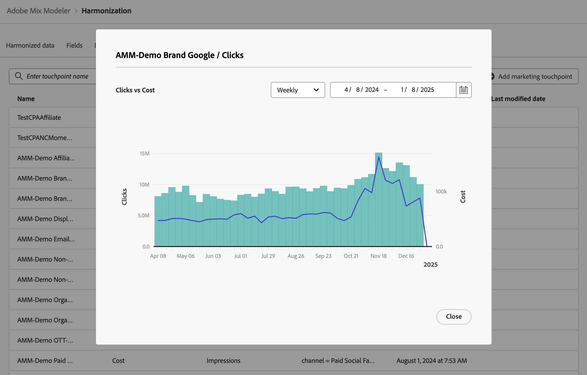

# マーケティングタッチポイント {#marketing-touchpoints}

>[!CONTEXTUALHELP]
>id="harmonizeddata_marketingtouchpoints_create"
>title="マーケティングタッチポイント"
>abstract="マーケティングタッチポイントは、数値または売上高ベースのコンバージョンに対するマーケティング投資の影響を評価するために使用される、受信者、個人または cookie レベルのマーケティングイベントです。"

マーケティングタッチポイントは、数値または売上高ベースのコンバージョンに対するマーケティング投資の影響を評価するために使用される、受信者、個人または cookie レベルのマーケティングイベントです。

マーケティングのタッチポイントを定義し、アトリビューション分析に役立てることができます。

## マーケティング顧客接点の管理

Mix Modeler インターフェイスで使用可能なマーケティングのタッチポイントのテーブルを表示するには：

1. 左側のパネルから「 **[!UICONTROL Harmonized data]**」を選択します。

1. 上部バーから&#x200B;**[!UICONTROL Marketing touchpoint]**&#x200B;を選択します。 マーケティングのタッチポイントの表が表示されます。 さらにページがある場合は、または （**[!UICONTROL Page _x _/_x_]**）を使用して、テーブルのページ間を移動します。

表の列には、マーケティングのタッチポイントに関する詳細が示されます。

| 列の名前 | 詳細 |
| --- | ---|
| 名前 | マーケティングのタッチポイントの名前。 |
| 支出指標 | タッチポイントの支出を計算するために使用する調和されたデータ指標。 |
| 体積指標 | タッチポイント数の計算に使用する調和データ指標。 |
| ルール | 使用するタッチポイントルール。 |
| 作成日時 | マーケティングのタッチポイントの作成日時。 |
| 最終変更日 | マーケティングのタッチポイントの最後の変更の日時。 |

## マーケティングのタッチポイントを追加

マーケティングタッチポイントを追加するには、Mix Modelerの **[!UICONTROL Harmonized data]** > **[!UICONTROL Marketing touchpoint]** インターフェイスで次の操作を行います。

1. 「 Add marketing touchpoint」を選択します。

1. **[!UICONTROL Marketing touchpoint]** ダイアログで。

   1. **[!UICONTROL Touchpoint Name]**&#x200B;の名前（例：`Luma Touchpoint`）を入力してください。

   1. **[!UICONTROL Touchpoint rule]**&#x200B;を定義します。

      1. **[!UICONTROL *調和&#x200B;*]**&#x200B;から値を選択します（例：**[!UICONTROL Brand]**）。

      1. 演算子の値（例：**[!UICONTROL is]**）を選択します。

      1. **[!UICONTROL *値&#x200B;*]**&#x200B;から値を選択するか、値（例：**[!DNL Luma]**）を入力します。

   1. **[!UICONTROL Touchpoint volume]**&#x200B;から調和されたフィールド （例：**[!UICONTROL Impressions]**）を選択します。

   1. **[!UICONTROL Touchpoint spend]**&#x200B;から調和されたフィールド （例：**[!UICONTROL Cost]**）を選択します。

      

   1. マーケティング タッチポイントを作成するには、**[!UICONTROL Create]**&#x200B;を選択します。 マーケティングタッチポイントの作成をキャンセルするには、「**[!UICONTROL Cancel]**」を選択します。

1. 作成すると、タッチポイントがマーケティングタッチポイントテーブルに追加されます。

## 詳細を表示

マーケティングのタッチポイントの詳細を表示するには：

1. テーブル内のマーケティングタッチポイント名にカーソルを合わせると、を選択します。

1.  **ビュー**&#x200B;を選択します。 ダイアログに、マーケティングのタッチポイントの詳細が表示されます。 詳しくは、[&#x200B; マーケティングタッチポイントの追加](#add-a-marketing-touchpoint)を参照してください。 ダイアログを閉じるには、**[!UICONTROL Cancel]**&#x200B;を選択します。

## レポートを読む

マーケティングのタッチポイントのレポートを表示するには：

1. テーブル内のマーケティングタッチポイント名にカーソルを合わせると、を選択します。

1. 「 **レポートを表示**」を選択します。 ダイアログに、マーケティングのタッチポイントのレポートが表示されます。

   

   * レポートする精度を変更するには、**[!UICONTROL Weekly]** ドロップダウンメニューから値を選択します。
   * レポートする期間を変更するには、開始日と終了日を入力するか、を使用してカレンダーのポップアップで期間を定義します。

1. ダイアログを閉じるには、**[!UICONTROL Close]**&#x200B;を選択します。

## マーケティングタッチポイントの削除

マーケティングタッチポイントを削除するには：

1. テーブル内のマーケティングタッチポイント名にカーソルを合わせると、 **削除**&#x200B;を選択します。
1. **[!UICONTROL Delete touchpoint]** ダイアログの確認ダイアログで「**[!UICONTROL Delete]**」を選択して、マーケティングタッチポイントを完全に削除します。

