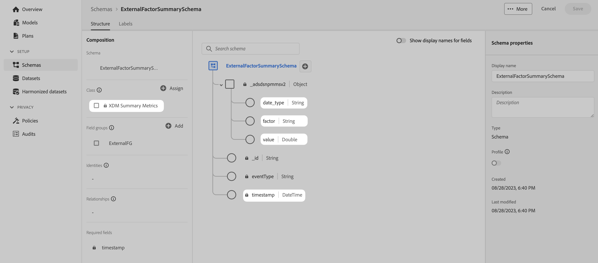

# スキーマ

スキーマを管理し、Adobe Experience Platformで取り込んでMix Modelerで使用するデータをサポートするには、次の手順を実行します。

1. 「Mix Modeler」インターフェイスに移動します。

1. 選択  **[!UICONTROL Schemas]**，の下 **[!UICONTROL DATA MANAGEMENT]**.

詳しくは、 [スキーマ UI の概要](https://experienceleague.adobe.com/docs/experience-platform/xdm/ui/overview.htm?lang=ja) を参照してください。

## データの集計または概要

Experience Platformで取り込み、Mix Modelerで使用する集計または概要データの基になるスキーマのベースとして、XDM Summary Metrics クラスを使用することを強くお勧めします。

XDM 概要指標クラスは、次の場合に使用します。

- ウォールガーデンデータ (FacebookやYouTubeのデータなど )。

- SPX（S&amp;P 500 株価指数）のデータなどの外部要因データ、気象データ

- 内部要因データ（価格の変更、休日のカレンダーなど）。

>[!IMPORTANT]
>
>取得したデータに必要な指標をサポートするために、スキーマ定義には、少なくとも 1 つの数値フィールド（整数、倍精度、ブール値、その他の数値タイプを使用）が含まれている必要があります。

を使用したスキーマ **[!DNL XDM Summary Metrics]** 基本クラスは、 **[!DNL ExternalFactorSummarySchema]** 下

このシンプルなスキーマは、次のデータを含むデータセットを取り込むために使用できます。

- 競合相手のインデックスデータ

  | タイムスタンプ | date_type | 要因 | 値 |
  |---|---|---|--:|
  | 2020-11-28T00:00:00.000Z | 週間 | competitor_index | 289.8 |
  | 2020-12-05T00:00:00.000Z | 週間 | competitor_index | 291.2 |
  | 2020-12-12T00:00:00.000Z | 週間 | competitor_index | 280.07 |
  | ... | ... | ... | ... |

- 公開休日データ

  | タイムスタンプ | date_type | 要因 | 値 |
  |---|---|---|--:|
  | 2020-11-28T00:00:00.000Z | 週間 | all_holidays_flag | 0.0 |
  | 2020-12-05T00:00:00.000Z | 週間 | all_holidays_flag | 0.0 |
  | 2020-12-12T00:00:00.000Z | 週間 | all_holidays_flag | 0.0 |
  | 2020-12-19T00:00:00.000Z | 週間 | all_holidays_flag | 0.0 |
  | 2020-12-26T00:00:00.000Z | 週間 | all_holidays_flag | 1.0 |
  | ... | ... | ... | ... |

より包括的な **[!DNL LumaPaidMarketingSchema]** の使用 **[!DNL XDM Summary Metrics]** を基本クラスとして使用します。 スキーマは、指標 (**[!DNL AMMMetrics]**)，ディメンション (**[!DNL AMMDimensions]**) や、その他のお客様固有の情報 (**[!DNL CustomerSpecific]**) をクリックします。

プロファイル取り込みの非同期性を考慮すると、外部ソースから集計データや概要データを収集する場合は、「外部ソースシステム監査の詳細」フィールドグループをスキーマの一部として使用することをお勧めします。 このフィールドグループは、外部ソースの監査プロパティのセットを定義します。
