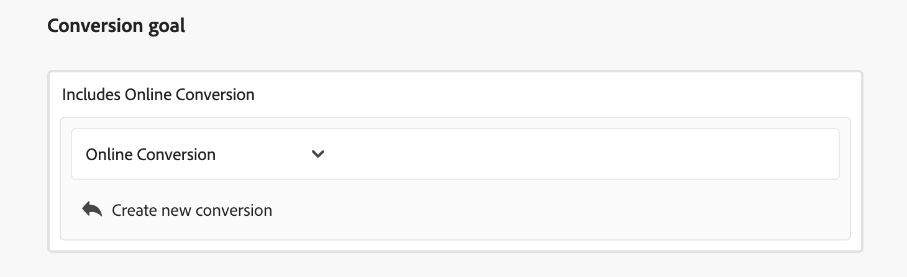
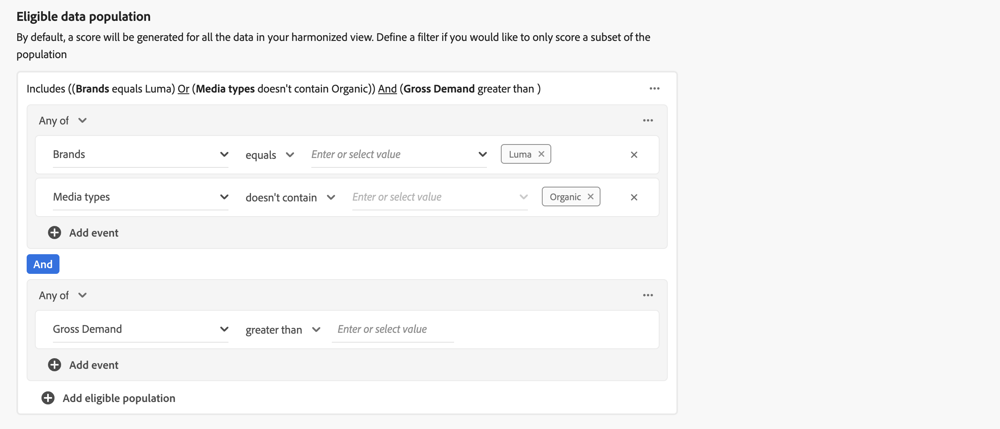
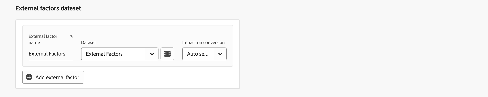

# モデルの作成

モデルを作成するには、  **[!UICONTROL Models]** インタフェース (Mix Modeler): **[!UICONTROL Guide me]**.

カスタム AI を利用したモデルを作成するためのインターフェイスには、ステップバイステップのガイドによるモデル設定フローが用意されています。

1. Adobe Analytics の **[!UICONTROL Setup]** 手順：

   1. モデルを入力 **[!UICONTROL Name]**&#x200B;例： `Demo model`. を入力します。 **[!UICONTROL Description]**&#x200B;例： `Demo model to explore AI featues of Mix Modeler`.

      

   1. 選択 **[!UICONTROL Next]** をクリックして、次の手順に進みます。 選択 **[!UICONTROL Cancel]** をクリックして、モデル設定をキャンセルします。

1. Adobe Analytics の **[!UICONTROL Configure]** 手順：

   1. Adobe Analytics の **[!UICONTROL Conversion goal]** セクション内の次の操作をおこないます。

      1. を入力します。 **[!UICONTROL Conversion name]** コンバージョンの場合、例： `Conversion`

      1. コンバージョンの選択元 **[!UICONTROL *調和済みフィールドを選択&#x200B;*]**：の一部として定義した使用可能なコンバージョンが含まれます。 [コンバージョン](../harmonize-data/conversions.md) in [!UICONTROL Harmonized datasets]. 例：**[!UICONTROL Online Conversion]**。

      1. 次の項目を選択できます。  **[!UICONTROL Create new conversion]** を使用して、モデル設定内から直接変換を作成できます。

         

   1. Adobe Analytics の **[!UICONTROL Marketing touchpoints]** 「 」セクションには、以下のように、定義したマーケティングタッチポイントに対応する、多数のマーケティングタッチポイントコンテナが表示されます [マーケティングタッチポイント](../harmonize-data/marketing-touchpoints.md) in [!UICONTROL Harmonized datasets].

      * 各コンテナに対して、次の操作を実行します。

         1. 次の項目を変更できます。 **[!UICONTROL Marketing touchpoint name]**.

         1. 次の中からマーケティングタッチポイントを選択します。 **[!UICONTROL _マーケティングタッチポイントを選択_]**.

         1. 次の項目を選択できます。  **[!UICONTROL Create new marketing touchpoint]** を使用して、モデル設定内から直接マーケティングタッチポイントを作成できます。

      * マーケティングタッチポイントコンテナを追加するには、「  **[!UICONTROL Add marketing touchpoint]**.

      * マーケティングタッチポイントコンテナを削除するには、コンテナ内で  を選択し、 **[!UICONTROL Remove container]** を選択します。

        

   1. デフォルトでは、調整済みビューのすべてのデータに対してスコアが生成されます。 母集団のサブセットにのみスコアを付けるには、 **[!UICONTROL Eligible data population]** 」セクションに入力します。

      * コンテナごとに、1 つ以上のイベントを定義します。

         1. 各イベントに対して：

            1. 次の中から指標またはディメンションを選択： **[!UICONTROL _調和済みフィールドを選択_]**.

            1. 適切な演算子を選択します。 **[!UICONTROL equals]**, **[!UICONTROL not equals]**, **[!UICONTROL less than]**, **[!UICONTROL greater than]**, **[!UICONTROL starts with]**, **[!UICONTROL doesn't start with]**, **[!UICONTROL ends with]**, **[!UICONTROL doesn't end with]**, **[!UICONTROL contains]**, **[!UICONTROL doesn't contain]**, **[!UICONTROL is in]**&#x200B;または **[!UICONTROL is not in]**.

            1. 値を入力または選択： **[!UICONTROL _値を入力または選択_]**.

         1. コンテナにイベントを追加するには、「  **[!UICONTROL Add event]**.

         1. コンテナからイベントを削除するには、「 」を選択します。 .

         1. コンテナで定義された複数のイベントをすべて使用してフィルタリングするには、「 」を選択します。 **[!UICONTROL Any of]** または **[!UICONTROL All of]**. ラベルは、それに応じて次のように変更されます。 **[!UICONTROL Include ... Or ...]** から **[!UICONTROL Include ... And ...]**.

      * 適格なデータ母集団コンテナを追加するには、「  **[!UICONTROL Add eligible population]**.

      * 適格なデータ母集団コンテナを削除するには、コンテナ内で「 」を選択します。  を選択し、 **[!UICONTROL Remove container]** を選択します。

        

   1. 外部要因を含むデータセットをモデルに追加するには、 **[!UICONTROL External factors dataset]** 」セクションに入力します。

      * 各コンテナに対して、次の操作を実行します。

         1. を入力します。 **[!UICONTROL Factor name]** 時刻 **[!UICONTROL _係数を入力_]**.

         1. データセットの選択元 **[!UICONTROL _データセットを選択_]**. 次の項目を選択できます。  を使用してデータセットを管理します。 詳しくは、 [データセット](../ingest-data/datasets.md) を参照してください。

      * 外部要因データセットコンテナを追加するには、「  **[!UICONTROL Add external factor]**.

      * 外部要因データセットコンテナを削除するには、コンテナ内で「 」を選択します。  を選択し、 **[!UICONTROL Remove container]** を選択します。

        

   1. 内部要因を含むデータセットをモデルに追加するには、 **[!UICONTROL Internal factors dataset]** 」セクションに入力します。

      * 各コンテナに対して、次の操作を実行します。

         1. を入力します。 **[!UICONTROL Factor name]** 時刻 **[!UICONTROL _係数を入力_]**.

         1. データセットの選択元 **[!UICONTROL _データセットを選択_]**. 次の項目を選択できます。  を使用してデータセットを管理します。 詳しくは、 [データセット](../ingest-data/datasets.md) を参照してください。

      * 内部要因データセットコンテナを追加するには、「  **[!UICONTROL Add internal factor]**.

      * 追加の内部要因データセットコンテナを削除するには、コンテナ内で「 」を選択します。  および **[!UICONTROL Remove container]** を選択します。

        

   1. モデルのルックバックウィンドウを定義するには、次の値を入力します。 `1` および `52` in **[!UICONTROL Give contribution credit to touchpoints occurring within]** ... **[!UICONTROL weeks prior to the conversion]**.

   1. 選択 **[!UICONTROL Next]** をクリックして、次の手順に進みます。 さらに設定が必要な場合は、赤いアウトラインとテキストで、追加の設定が必要な内容を説明します。  選択 **[!UICONTROL Back]** 前の手順に戻ります。  選択 **[!UICONTROL Cancel]** をクリックして、モデル設定をキャンセルします。

1. Adobe Analytics の **[!UICONTROL Advanced]** 手順：

   1. Adobe Analytics の **[!UICONTROL Define training window]** セクション、次の中から選択

      * **[!UICONTROL Have Mix Modeler select a helpful training window]** および

      * **[!UICONTROL Manually input a training window]**。選択した場合、年数を **[!UICONTROL Include events the following years prior to a conversion]**.

        

   1. Adobe Analytics の **[!UICONTROL Spend share]** セクション：

      * 過去のマーケティング投資比率を使用して、マーケティングデータが少ない場合にモデルに通知するには、を有効化します **[!UICONTROL Allow spend share]**.

   1. Adobe Analytics の **[!UICONTROL Prior knowledge]** セクション：

      1. 「**[!UICONTROL Rule type]**」を選択します。

      1. 配分率を、以下に示す各チャネルに対して割合を割り当てます。 **[!UICONTROL Name]**、 **[!UICONTROL Contribution proportion]** 列。 割合の合計配分の合計が 100%になるようにします。

      1. 各チャネルに対して、 **[!UICONTROL Level of confidence]** 割合。

      1. 必要に応じて、 **[!UICONTROL Clear all]** すべての入力値をクリアするには **[!UICONTROL Contribution proportion]** および **[!UICONTROL Level of confidence]** 列。

         

1. 選択 **[!UICONTROL Finish]** をクリックして、モデルの設定を完了します。

   * Adobe Analytics の **[!UICONTROL Create instance?]** ダイアログ、選択 **[!UICONTROL Ok]** を追加します。 モデルがステータスと共に表示されます ● **[!UICONTROL Awaiting training]**。

     選択 **[!UICONTROL Cancel]** をクリックしてキャンセルします。

   * さらに設定が必要な場合は、赤いアウトラインとテキストで、追加の設定が必要な内容を説明します。

   選択 **[!UICONTROL Back]** 前の手順に戻ります。

   選択 **[!UICONTROL Cancel]** をクリックして、モデル設定をキャンセルします。

