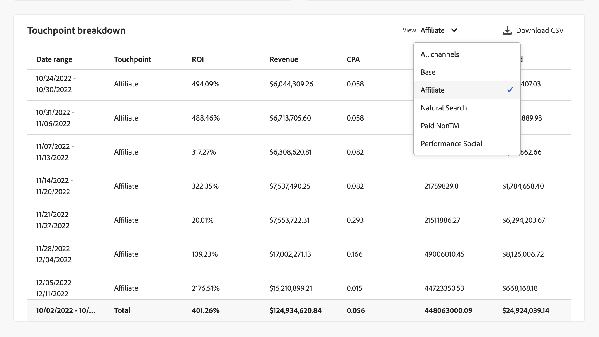

# モデルインサイト

モデルインサイトの各ビジュアライゼーションは、次の操作を支援するように設計されています。

* 組織のマーケティングアクティビティの影響を視覚化し、定量化します。
* パフォーマンスの高いチャネルを特定します。
* 最適化が必要なチャネルを特定します。

これらのインサイトは、リソースの優先順位と割り当てをサポートするのに役立ちます。

モデルインサイトを表示するには、Mix Modelerの  **[!UICONTROL Models]** インターフェイスで次の操作を行います。

1. **[!UICONTROL Models]** テーブルから、**[!UICONTROL Last run status]** が ● のモデルの名前を選択します **[!UICONTROL Success]**。

1. コンテキストメニューから「**[!UICONTROL Model Insights]**」を選択します。

次のタブを使用できます。

* [モデルインサイト](#model-insights)
* [ 要因 ](#factors-beta) [!BADGE &#x200B; ベータ版 &#x200B;]
* [ アトリビューション ](#attribution) （MTA 対応モデルのみ）
* [診断](#diagnostics)
* [ 履歴の概要 ](#historical-overview).

各タブのビジュアライゼーションの基になる期間を変更できます。 日付範囲を入力するか、「」を選択して日付範囲を選択します。

## モデルドリフト

{{release-limited-testing-section}}

モデル上でモデルドリフトが検出された場合は、後で通知を受けるオプションや、モデルを直ちに **[!UICONTROL Model drift detected]** 示するオプションを含む [**[!UICONTROL Retrain]**](overview.md#retrain) ダイアログが表示されます。 **[!UICONTROL Remind me later]** を選択すると、次の日または次のログイン時に通知されます。

## [!UICONTROL Model insights]

モデルインサイト タブには、[ 日付およびベースメディア別の貢献度 ](#contribution-by-date-and-base-media)、[ チャネル別の貢献度 ](#contribution-by-channel)、[ マーケティングパフォーマンスの概要 ](#marketing-performance-summary)、および [ 限界応答曲線 ](#marginal-response-curves) のビジュアライゼーションが表示されます。 このタブには、[ タッチポイント分類 ](#touchppint-breakdown) テーブルも表示されます。

* 各ビジュアライゼーションの個々のグラフ要素にポインタを合わせると、詳細を含むポップオーバーが表示されます。

* ビジュアライゼーションのデータを含んだ CSV ファイルをダウンロードするには、「」を選択します。

* Microsoft® Excel 形式で完全なモデルインサイトデータをダウンロードするには、「**[!UICONTROL Download data]** を選択します。

### 貢献度（日付およびベースメディア別）

この積み重ねグラフのビジュアライゼーションは、次のような順序になっています。

* 下部にベースが表示されます。
* 費用以外のチャネルは中央に表示されます。
* 費用チャネルは上に表示されます。

このビジュアライゼーションは、日付範囲で、ベース、支出チャネル別および非支出チャネル別に達成された貢献度の割合を表します。 このビジュアライゼーションは、増分を紹介する場合に役立ちます。 ベースは、マーケティングがまったく行われなくても発生した事象を表し、非支出チャネルと（ベースの上に）支出チャネルがマーケティングの影響に属性を与えます。 つまり、非支出と支出を足すと、マーケティング活動の増分的な影響と等しくなり、ビジュアライゼーションはマーケティングが生み出す値を簡単にinsightします。

### 貢献度（チャネル別）

様々なチャネルによる貢献度の分布を表示するドーナツビジュアライゼーション。 このビジュアライゼーションでは、上位 3 つのパフォーマンスの高いチャネル（ベースおよび *その他すべて* カテゴリを除く）のレンズを通じて増分を表示します。 このビジュアライゼーションは、優先順位付けと予算割り当てをサポートするのに役立ちます。

### マーケティング効果の概要。

各チャネルの ROI または CPA パフォーマンスを表示する横棒グラフビジュアライゼーション。 このビジュアライゼーションは、マーケティング投資の ROI/CPA をハイライト表示します。 チャネルは、ROI/CPA に基づいて降順でランク付けされます。 このビジュアライゼーションは、最も効果的なチャネルと、最適化が必要なチャネルを特定するのに役立ちます。

### 限界応答曲線。

折れ線グラフは、マーケティングチャネルでの投資によって生成された限界収益を視覚化し比較します。  そして、増分利益が増分費用よりも少ない損益分岐点を特定します。 その結果、このビジュアライゼーションは、マーケティング投資の影響が小さくなり始めたタイミングを理解するのに役立ちます。

選択したデータ範囲と選択したチャンネルに基づいて、カーブ、ブレークポイント、および対応する値が計算されます。

チャネルを変更するには：

* **[!UICONTROL Channel]** ドロップダウンメニューからチャネルを選択して、特定のチャネルのビジュアライゼーションを更新します。

### タッチポイント分類

タッチポイント分類テーブルには、すべてまたは選択したチャネルの週別タッチポイント分類が週別ベースで表示され、それぞれに関連付けられた主要指標が表示されます。 この表を使用すると、比較、トレンドの特定、パフォーマンスの追跡を、より詳細なチャネルレベルで容易に行うことができます。 この表は、[ 日付およびベースメディア別の貢献度 ](#contribution-by-date-and-base-media) ビジュアライゼーションと [ チャネル別の貢献度 ](#contribution-by-channel) ビジュアライゼーションを明示的に補完しています。

次の列を使用できます。

| 列 | 説明 |
|---|---|
| **[!UICONTROL Date range]** | レポートする週。 |
| **[!UICONTROL Touchpoint]** | 特定のタッチポイントチャネル。 |
| **[!UICONTROL ROI]** | （**[!UICONTROL Revenue]** ～ **[!UICONTROL Spend]**） / **[!UICONTROL Spend]** の割合。 |
| **[!UICONTROL Revenue]** | 日付範囲の売上高。 |
| **[!UICONTROL CPA]** | **[!UICONTROL Spend]** / **[!UICONTROL Conversions]**。 |
| **[!UICONTROL Conversions]** | 日付範囲のコンバージョン。 |
| **[!UICONTROL Spend]** | データ範囲に対する支出。 |

特定のチャネルまたはすべてのチャネルを選択するには、**[!UICONTROL View]** ドロップダウンメニューから選択します。

タッチポイント分類テーブルのコンテンツをダウンロードするには、「」 **[!UICONTROL Download CSV]** 選択します。

## **[!UICONTROL Factors]** [!BADGE &#x200B; ベータ版 &#x200B;]

「要因 [!BADGE &#x200B; ベータ版 &#x200B;]」タブには、外部要因関連のインサイトが表示されます。

このビジュアライゼーションは、様々な内部および外部の要因がコンバージョンのベースラインに与える増分的な影響を理解するのに役立ちます。 例えば、経済状況やプロモーション活動などです。

**[!UICONTROL Factors]** ドロップダウンメニューを使用して、表示する要因を選択します。

<!-- need to update the image when we do have a proper example -->

テーブルのデータを含む CSV ファイルをダウンロードするには、「」を選択します。

使用できるデータがない場合は、メッセージ  **[!UICONTROL No data is available, you may need to retrain your model, or change the date range to view insights]** が表示されます。

## [!UICONTROL Attribution]

>[!NOTE]
>
>「アトリビューション」タブは、MTA 対応モデルでのみ使用できます。

「[!UICONTROL Attribution]」タブを使用すると、イベントレベルのデータを持つタッチポイントとマーケティングキャンペーンの効果を把握できます。  [ モデルを作成 ](build.md) を参照してください。

次のアトリビューションモデルがサポートされています。

* Mix Modelerで選択したモデルに基づく：
   * アルゴリズム – 影響
   * アルゴリズム – 増分
* ルールベース：
   * 減衰単位
   * ファーストタッチ
   * ラストタッチ
   * 線形
   * U字型

Mix Modelerのマルチタッチアトリビューション機能の概要については、[ マルチタッチアトリビューション ](../get-started/about.md#multi-touch-attribution) を参照してください。

**[!UICONTROL Attribution Model]** ドロップダウンメニューから 1 つ以上のアトリビューションモデルを選択します。 選択したアトリビューションモデルは、「アトリビューション」タブのすべてのビジュアライゼーションに適用されます。

Mix Modelerのマルチタッチ アトリビューションのきめ細かいイベントスコアは、Mix Modelerの全体的なスコアと ROI に一致します。 これらのスコアは、Experience Platformのデータセットとしても使用できます。

「アトリビューション」タブは、次のビジュアライゼーションで構成されます。

### [!UICONTROL Overview]

[!UICONTROL Overview] のビジュアライゼーションには、選択したアトリビューションモデルに関して、コンバージョンの合計とパーセンテージが表示されます。 さらにモデルを選択すると、ビジュアライゼーションに円が追加され、凡例に対応する独自の色が付きます。

アトリビューションモデルの詳細を含むポップアップを表示するには、ビジュアライゼーションの任意の円にポインタを合わせます。

### [!UICONTROL Trends]

[!UICONTROL Daily trends]、[!UICONTROL Weekly trends] または [!UICONTROL Monthly trends] のビジュアライゼーションは、選択したアトリビューションモデルに関して、日別、週別または月別のコンバージョンのトレンドを表示します。

期間を選択するには、「**[!UICONTROL Daily trends]**」、「**[!UICONTROL Weekly trends]**」または「**[!UICONTROL Monthly trends]**」を  から選択します。

詳細を確認するには、特定のアトリビューションモデルのデータラインにカーソルを合わせると、そのデータのコンバージョンの合計数を表示するポップオーバーが表示されます。

### [!UICONTROL Breakdown]

[!UICONTROL Breakdown] のビジュアライゼーションは、選択した各アトリビューションモデルのコンバージョンのチャネルまたはタッチポイントによる分類です。 このビジュアライゼーションは、各チャネルやタッチポイントの有効性を判断するのに役立ちます。

分類のタイプを選択するには、「**[!UICONTROL Breakdown by channel]**」または「**[!UICONTROL Breakdown by touchpoint]**」を  から選択します。

詳細を表示するには、任意のグラフ要素にポインタを合わせます。

### [!UICONTROL Top campaigns]

上位キャンペーンのビジュアライゼーションには、キャンペーン名、チャネル、メディアタイプおよび増分コンバージョンの列を含む上位キャンペーンのテーブルが表示されます。 このビジュアライゼーションは、特定のチャネルに対する特定のキャンペーンの有効性をチームに知らせ、さらに投資する必要のあるキャンペーンに関するインサイトを提供するのに役立ちます。

チャネル、メディアタイプ、増分コンバージョンでテーブルを昇↑または降順に並べ替える↓合は、列ヘッダーを選択して並べ替えを切り替えます。

別のダイアログでテーブルを展開するには、「**[!UICONTROL Expand]** 細  を選択します。

展開されたトップキャンペーン ダイアログには、と同じテーブルに対する追加列が表示されます

* 増分変換
* 影響コンバージョン
* ファーストタッチコンバージョン
* ラストタッチコンバージョン

  追加の各列ヘッダーを選択して、昇順または降順でテーブルを並べ替えることができます。

展開された「上位キャンペーン」ダイアログを閉じるには、「**[!UICONTROL Close]**」を選択します。

### [!UICONTROL Breakdown by touchpoint position]

[!UICONTROL Breakdown by touchpoint position] のビジュアライゼーションは、すべてのコンバージョンパスをまたいだタッチポイントとタッチポイントの位置別の、アトリビューションコンバージョンの分類です。 このグラフは、タッチポイントが任意の位置の残りの位置や他のタッチポイントよりも、その位置での寄与が良いかどうかを比較するのに役立ちます。

>[!NOTE]
>
>すべてのタッチポイントおよびポジションにわたる属性モデルの貢献率の合計は、100 に等しくする必要があります。

位置 [!UICONTROL Starter]、[!UICONTROL Player] および [!UICONTROL Closer] は、次のように定義されます。

| 位置 | 説明 |
|---|---|
| [!UICONTROL Starter] | この位置は、タッチポイントがコンバージョンパスのファーストタッチであるかどうかを示します。 |
| [!UICONTROL Player] | この位置は、タッチポイントがコンバージョンにつながるファーストタッチまたはラストタッチでないかどうかを示します。 |
| [!UICONTROL Closer] | この位置は、タッチポイントがコンバージョン前のラストタッチであるかどうかを示します。 |

### [!UICONTROL Top conversion paths]

[!UICONTROL Top conversion paths] のビジュアライゼーションには、選択したアトリビューションモデルに基づく上位 5 つのコンバージョンパスが表示されます。

各コンバージョンパスには、以下が表示されます。

* 影響を与えるチャネルの数、
* 合計アトリビューションパス
* 合計アトリビューションパスに対する、このコンバージョンパスのアトリビューションパスの割合、
* チャネルごとに、アトリビューションモデルの貢献度のパーセンテージ、
* これらのチャネルアトリビューションモデルのコントリビューションパーセンテージの合計。

## [!UICONTROL Diagnostics] {#diagnostics}

>[!CONTEXTUALHELP]
>id="models_diagnostics_modelassessment"
>title="モデル評価グラフ"
>abstract="モデル評価のビジュアライゼーションでは、実際のコンバージョンと予測コンバージョンまたは残差コンバージョンが分類されます。"
>additional-url="https://experienceleague.adobe.com/ja/docs/mix-modeler/using/overview" text="Mix Modeler の概要"
>additional-url="https://video.tv.adobe.com/v/3440795/?learn=on&amp;enablevpops&captions=jpn" text="Mix Modeler デモ"

>[!CONTEXTUALHELP]
>id="models_diagnostics_pathstouched"
>title="タッチされたパス"
>abstract="タッチされたパスは、各タッチポイントでコンバージョンを達成しているパスの割合と、コンバージョンを達成していないパスの割合です。"

>[!CONTEXTUALHELP]
>id="models_diagnostics_modeldateinfo"
>title="モデルの日付（日時）"
>abstract="このテーブルのデータは、特定の期間のみ生成されます。**[!UICONTROL As of]** の日付は、データが生成された日付を示し、startDate から endDate までのデータに基づいています。"

「**[!UICONTROL Diagnostics]**」タブには、次のビジュアライゼーションが表示されます。

* 次の要素で構成されるビジュアライゼーションを **[!UICONTROL Model Assessment]** 成します。

  

   * コンバージョンの実績と予測または残差を分類できるグラフ。
ビジュアライゼーションを分類するには、ビジュアライゼーションリストから次のいずれかのオプションを選 **[!UICONTROL Breakdown]** します。

      * **[!UICONTROL Actual vs Predicted]**：このオプションでは、実際の値がモデルの予測と比較されます。 多少の偏差は予想されますが、予測値は実際の値にしっかりと一致するのが理想的です。 大きなまたは系統的な逸脱またはパターンは、関係およびデータの欠落やバイアスの可能性を示唆する。

      * **[!UICONTROL Residuals]**：このオプションは、実際の値と予測された値の違いを表示します。 パフォーマンスの高いモデルには、明確なパターンやスプレッドの増加なしに、ランダムに分布する残差があります。 構造化されたトレンドや拡大する残差は、関係の欠落やデータまたは差異の問題を示している場合があります。

   * 各コンバージョン指標に関する次の列を示す表：

      * **[!UICONTROL Actual Conversion]**
      * **[!UICONTROL Predicted Conversion]**
      * **[!UICONTROL Residual Conversion]**
      * **[!UICONTROL R2]**：データが回帰モデルにどの程度適合するかを示すスコア（適合の良さ）。
      * **[!UICONTROL MAPE]** （平均絶対誤差率）：予測精度を測定するために最も一般的に使用される KPI の 1 つで、予測誤差を実績値のパーセンテージで表します。
      * **[!UICONTROL RMSE]** （二乗平均平方誤差）：誤差の二乗に従って重み付けされた、平均誤差を表示します。

  テーブルのデータを含む CSV ファイルをダウンロードするには、「」を選択します。

* 各コ **[!UICONTROL Model training fit metrics]** バージョン指標に対して表示されるテーブル：

  

   * **[!UICONTROL Training R2]**: モデルの予測によって説明された実際の値の差異の割合を 0 ～ 1 の範囲で示します。
   * **[!UICONTROL Training sMAPE]** （対称平均絶対誤差率）: トレーニングデータの平均誤差率を測定します。 値が小さいほど、精度が高くなります。
   * **[!UICONTROL Training RMSE]** （二乗平均誤差の根本）: トレーニングデータの平均誤差率を測定します。 MAPE よりも大きなエラーをペナルティで処理します。 RMSE が低いほど、予測精度が高いと示唆されるが、異常値の影響を受けやすい。
   * **[!UICONTROL Out-of-sample sMAPE]**：予測の超過と過少のバランスを取りながら、見えないデータのエラーの割合を評価します。 一般化を評価するのに役立ちます。 現在、Mix Modelerでは、トレーニングデータの前四半期を除外セットとして使用して、エラーの割合を評価しています。
   * **[!UICONTROL Out-of-sample RMSE]**：予測の超過と過少のバランスを取りながら、見えないデータのエラーの割合を評価します。 一般化を評価するのに役立ちます。 現在、Mix Modelerでは、トレーニングデータの前四半期を除外セットとして使用して、エラーの割合を評価しています。 RMSE は、MAPE よりも大きなエラーにペナルティを課します。

* **[!UICONTROL Touchpoint effectiveness]** トリビューション AI アルゴリズムモデルの結果を表したテーブル。

  

  このテーブルのデータは、特定の期間のみ生成されます。 詳細は、「**[!UICONTROL As of *xx/xx/xx, xx:xx TZ *]**」を選択してください。

  ビジュアライゼーションでは、タッチポイントご [!UICONTROL Efficiency measure] に降順  で表示されます。

   * **[!UICONTROL Paths touched]**: コンバージョンを達成するパスの割合とコンバージョンを達成しないパスの割合を視覚化します。 タッチポイントの場合、アトリビューションコンバージョン率が高いと、より多くのアトリビューションコンバージョンが表示されます。 この比率では、コンバージョンにつながるパスの割合と、コンバージョンにつながる *つながらない* パスの割合が比較されます。
   * **[!UICONTROL Efficiency measure]**: アルゴリズムアトリビューションモデルによって生成される効率測定は、タッチポイント量に関係なく、コンバージョンに対するタッチポイントの相対的な重要度を示します。 効率は 1～5 のスケールで測定されます。 タッチポイント量が多いからといって、効率測定が高くなるとは限りません。
   * **[!UICONTROL Total volume]**：ユーザーがタッチポイントにタッチした合計回数。 この数は、コンバージョンを達成するパスと、コンバージョンに至るパス *ではない* に表示されるタッチポイントを含みます。

### モデルドリフト検出

>[!AVAILABILITY]
>
>この節で説明している機能は、リリースの限定的テスト段階にあり、お使いの環境ではまだ使用できない可能性があります。 機能が一般入手可能になったら、このメモは削除されます。 Mix Modeler リリースプロセスについて詳しくは、[Mix Modeler機能リリース ](/help/releases/latest.md) を参照してください。
>

モデルのドリフトが検出されると、上部に **[!UICONTROL Model drift detected]** の通知が表示されます。

「**[!UICONTROL Hide]**」を選択すると、通知が非表示になります。 通知は、翌日または次回のログイン時に再び表示されます。

## [!UICONTROL Historical overview]

履歴の概要タブには、次のビジュアライゼーションが表示されます。

### コンバージョンと支出（会計四半期および製品別）

このビジュアライゼーションは、指定された日付範囲内の様々な四半期におけるコンバージョンと支出の分布を表します。 このビジュアライゼーションは、支出がコンバージョンを促進しているパフォーマンスの高い四半期を特定するのに役立ちます。

### チャネル別の支出

このビジュアライゼーションは、指定された日付範囲内の様々なチャネルにわたる支出分布を表します。 ビジュアライゼーションは、最も多くの支出を受け取るチャネルの迅速な識別をサポートします。

### タッチポイント支出

このビジュアライゼーションは、指定された日付範囲内の四半期ごとの有料タッチポイントにわたる支出分布を表します。 ビジュアライゼーションを使用すると、特定のチャネルや四半期内で、どのタッチポイントの優先度が高いのかを把握できます。 このビジュアライゼーションは、チャネルの支出パターンとトレンド、特に経時的に支出が少ないチャネルと少ないチャネルを特定するのに役立ちます。

このビジュアライゼーションに表示する別の費用ベースのチャネルを選択するには：

* **[!UICONTROL Channels]** からチャネルを選択します。

### タッチポイント量

このビジュアライゼーションは、指定された日付範囲内の四半期ごとの、すべてのタッチポイントにわたる体積分布を表します。

このビジュアライゼーションで表示する代替のボリュームベースのチャネルを選択するには：

* **[!UICONTROL Channels]** からチャネルを選択します。

## **[!UICONTROL Edit]**

モデルの名前、説明、およびトレーニングとスコアリングのスケジュールを編集できます。

1. 「 編集」を選択します

1. **[!UICONTROL Edit model]** ダイアログで、次の手順を実行します。

   * 新しい **[!UICONTROL Name]** と **[!UICONTROL Description]** を入力します。

   * スケジュールを有効にするには、**[!UICONTROL Status]** を有効にします。 トレーニングおよびスコアリングされたモデルのスケジュールのみを有効にできます。

      1. **[!UICONTROL Scoring frequency]** を選択：

         * **[!UICONTROL Daily]**：有効な時間（例：`05:22 pm`）を入力するか、 を使用します。
         * **[!UICONTROL Weekly]**：曜日を選択して有効な時間（例：`05:22 pm`）を入力するか、 を使用します。
         * **[!UICONTROL Monthly]**: 「実行するタイミング」ドロップダウンメニューから日付を選択し、有効な時刻（例：`05:22 pm`）を入力するか、 を使用します。

      1. ドロップダウンメニューから **[!UICONTROL Training frequency]** （**[!UICONTROL Monthly]**、**[!UICONTROL Quarterly]**、**[!UICONTROL Yearly]**、**[!UICONTROL None]** のいずれか）を選択します。

     

1. **[!UICONTROL Save]** を選択します。
