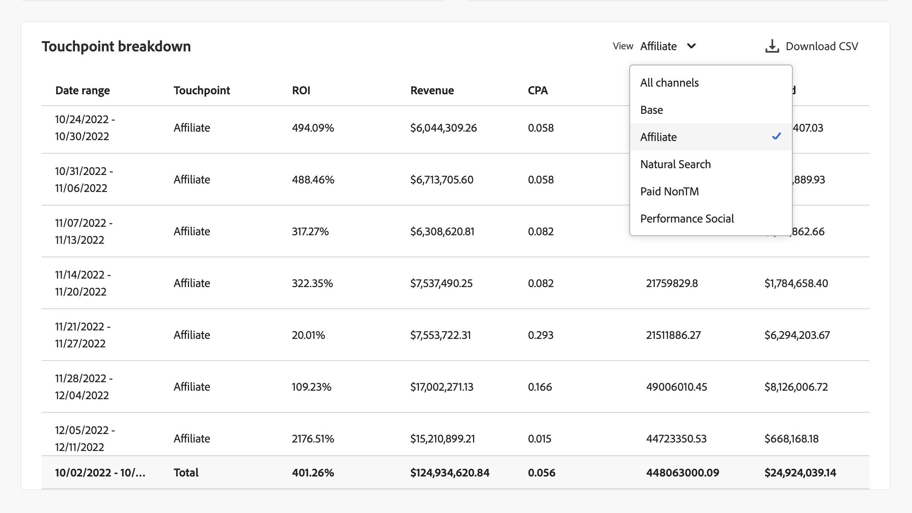
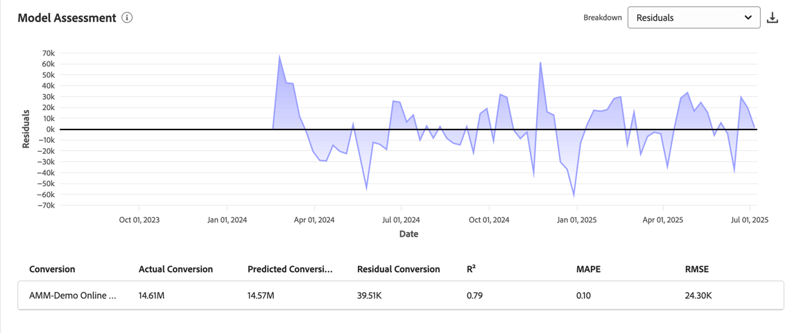
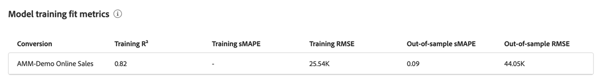
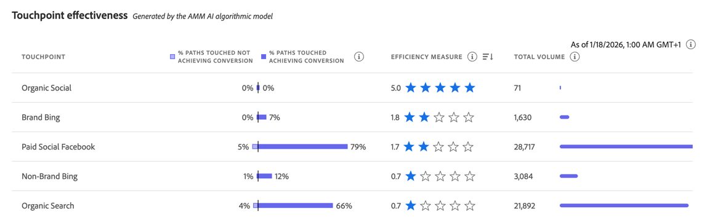

# モデルインサイト

モデルインサイトの各ビジュアライゼーションは、次のことを実行できるように設計されています。

* 組織のマーケティングアクティビティの影響を視覚化し、定量化します。
* パフォーマンスの高いチャネルを特定します。
* 最適化が必要なチャネルを特定します。

これらのインサイトは、リソースの優先順位付けと割り当てをサポートするのに役立ちます。

モデルインサイトを表示するには、Mix Modelerの **[!UICONTROL Models]** インターフェイスで次の操作を行います。

1. **[!UICONTROL Models]** テーブルから、**[!UICONTROL Last run status]**&#x200B;の **[!UICONTROL Success]**&#x200B;を持つモデルの名前を選択します。

1. コンテキストメニューから、**[!UICONTROL Model Insights]**&#x200B;を選択します。

次のタブを使用できます。

* [モデルインサイト](#model-insights)
* [チャネルシナジー](#channel-synergy)
* [要因](#factors-beta) [!BADGE &#x200B; ベータ &#x200B;]
* [&#x200B; アトリビューション &#x200B;](#attribution) （MTA対応モデルのみ）
* [診断](#diagnostics)
* [履歴の概要](#historical-overview)。

各タブのビジュアライゼーションの基となる日付の期間を変更できます。 日付期間を入力するか、を選択して日付期間を選択します。

## モデルドリフト

{{release-limited-testing-section}}

モデルのドリフトがモデル上で検出された場合は、後で通知するオプションや、モデルをすぐに[**[!UICONTROL Retrain]**](overview.md#retrain)するためのオプションを含む&#x200B;**[!UICONTROL Model drift detected]** ダイアログが表示されます。 **[!UICONTROL Remind me later]**&#x200B;を選択すると、次の日または次のログイン時にリマインドされます。

## モデルインサイト {#model-insights-section}

「モデルインサイト」タブには、[日付およびベースメディア別の貢献度](#contribution-by-date-and-base-media)、[&#x200B; チャネル別の貢献度](#contribution-by-channel)、[&#x200B; マーケティングパフォーマンスの概要](#marketing-performance-summary)、[限界応答カーブ &#x200B;](#marginal-response-curves)のビジュアライゼーションが表示されます。 このタブには、[&#x200B; タッチポイントの分類](#touchppint-breakdown) テーブルも表示されます。

* 各ビジュアライゼーションの個々のグラフ要素にカーソルを合わせると、より詳細なポップオーバーが表示されます。

* ビジュアライゼーションのデータを含むCSV ファイルをダウンロードするには、を選択します。

* Microsoft® Excel形式で完全なモデルインサイトデータをダウンロードするには、 **[!UICONTROL Download data]**&#x200B;を選択します。

### 日付およびベースメディア別の貢献度

この積み重ねグラフのビジュアライゼーションは、次のように並んでいます。

* ベースは下部に表示されます。
* 未支出チャネルは真ん中に表示されます。
* 支出チャネルが一番上に表示されます。

この可視化は、日付範囲において、ベース、支出チャネル、非支出チャネルごとに達成された貢献度の割合を表しています。 このビジュアライゼーションは、増分性を示すのに役立ちます。 基本とは、マーケティング施策を実施しなかった場合の影響を表すもので、予算の非支出チャネルと支出チャネル（基本の上）を組み合わせることで、マーケティング施策の効果を示します。 つまり、無支出+支出は、マーケティング活動の増分効果に等しく、ビジュアライゼーションは、マーケティングが生み出す価値をinsightで簡単に提供します。

### チャネル別の貢献度

様々なチャネルによる貢献度の分布を示すドーナツビジュアライゼーション。 このビジュアライゼーションでは、パフォーマンスが高い上位3つのチャネル（基本と&#x200B;*その他* カテゴリーを除く）のレンズを通じて増分性を示します。 このビジュアライゼーションは、優先順位付けと予算配分をサポートするのに役立ちます。

### マーケティングパフォーマンスの概要 {#marketing-performance-summary}

>[!CONTEXTUALHELP]
>id="models_insights_undefinedchannels"
>title="未定義のチャネル"
>abstract="未定義のチャネルは含まれますが、コンバージョンの帰属を示しません。"

各チャネルのROIまたはCPA パフォーマンスを表示する、横棒グラフのビジュアライゼーション。 このビジュアライゼーションは、マーケティング投資のROI/CPAを強調します。 チャネルは、ROI/CPAに基づいて降順にランク付けされます。 このビジュアライゼーションは、最も効果的なチャネルと最適化が必要なチャネルを特定するのに役立ちます。

未定義のチャネルはビジュアライゼーションに含まれますが、コンバージョンに起因するものはありません。

### 限界応答曲線

折れ線グラフは、マーケティングチャネルへの投資によって生み出される限界利益を視覚化し、比較します。  また、現在の支出ポイントと限界損益分岐点（増分リターンが増分支出よりも少ない場合）を特定できます。 これにより、マーケティング投資の効果が低下し始めるタイミングを把握できます。

選択したデータ範囲と選択したチャネルに基づいて、曲線、現在の支出点、限界損益分岐点、および対応する値が計算されます。

チャネルを変更するには：

* **[!UICONTROL Channel]** ドロップダウンメニューからチャネルを選択して、特定のチャネルのビジュアライゼーションを更新します。

### 顧客接点の内訳

タッチポイントの内訳テーブルには、すべてのチャネルまたは選択したチャネルの週次タッチポイントの内訳が週次ベースで表示され、それぞれに関連する主要な指標が表示されます。 この表を使用すると、簡単に比較、トレンドの特定、パフォーマンスの追跡をより詳細なチャネルレベルで行うことができます。 このテーブルは、日付と基本メディアによる[貢献度](#contribution-by-date-and-base-media)のビジュアライゼーションと、チャネルによる[貢献度](#contribution-by-channel)のビジュアライゼーションを明示的に補完します。

次の列を使用できます。

| 列 | 説明 |
|---|---|
| **[!UICONTROL Date range]** | 報告する週です。 |
| **[!UICONTROL Touchpoint]** | タッチポイントチャネルの定義です。 |
| **[!UICONTROL ROI]** | （**[!UICONTROL Revenue]** - **[!UICONTROL Spend]**） / **[!UICONTROL Spend]**&#x200B;の割合。 |
| **[!UICONTROL Revenue]** | 日付範囲の収益。 |
| **[!UICONTROL CPA]** | **[!UICONTROL Spend]** / **[!UICONTROL Conversions]**. |
| **[!UICONTROL Conversions]** | 日付範囲のコンバージョンです。 |
| **[!UICONTROL Spend]** | データ範囲の支出。 |

特定のチャネルまたはすべてのチャネルを選択するには、**[!UICONTROL View]** ドロップダウンメニューからを選択します。

タッチポイント分類テーブルの内容をダウンロードするには、 **[!UICONTROL Download CSV]**&#x200B;を選択します。

## チャネルシナジー

**[!UICONTROL Channel synergy]** タブの&#x200B;**[!UICONTROL Channel synergies]**&#x200B;のビジュアライゼーションは、マーケティングチャネルが個々の貢献を超えて、乗法効果を作成するためにどのようにインタラクションしているかを特定するのに役立ちます。

ヒートマップ行列は、経費チャネルのペア間の相乗効果の値を視覚的に表します。 マーケターは、このマトリックスを利用して、チャネルがパフォーマンスを促進するためにどのようにインタラクションしているのかを把握できます。 各モデルについて、シナジー値は0から10の範囲で正規化されます。 これらの値は、*次ドルの相乗効果*&#x200B;を定量化します。これは、各チャネルが現在のレベルでさらに1 ドルの支出を受け取った場合に、2つのチャネルがどの程度効果的に連携するかを推定します。

この1 ドル規模の枠組みは、トレーニングデータにおける実際の支出状況を考慮し、より多くの情報に基づいた最適化決定を可能にするため、相対的な相乗効果の強さを現実的に示しています。

行列を表すCSV ファイルをダウンロードするには、 **[!UICONTROL Download]**&#x200B;を選択します。

>[!NOTE]
>
>既存のモデルに対して&#x200B;**[!UICONTROL Channel synergy]** タブが表示されない場合は、モデルを維持して機能とビジュアライゼーションを有効にします。

## 要因 {#factors}

>[!CONTEXTUALHELP]
>id="models_factors_factorcontributionbreakdown"
>title="貢献度の内訳"
>abstract="要素貢献度の分類は、モデルに含まれる様々な要因に起因する基本コンバージョンの割合を示します。  純粋なベースは、マーケティングのタッチポイントとモデルに含まれる要因に依存せずに発生する基本コンバージョンを表します。 これには、ブランドエクイティ、リピート購入、オーガニック需要、長期的な市場トレンドや季節性によるコンバージョンが含まれます。"

「要因[!BADGE &#x200B; ベータ版]」タブには、外部要因に関連するインサイトが表示されます。

このビジュアライゼーションは、さまざまな内部要因と外部要因がコンバージョンのベースラインに及ぼす増分効果を把握するのに役立ちます。 例えば、経済活動やプロモーション活動。

**[!UICONTROL Factors]** ドロップダウンメニューを使用して、表示する要素を選択します。

<!-- need to update the image when we do have a proper example -->

テーブルのデータを含むCSV ファイルをダウンロードするには、を選択します。

使用可能なデータがない場合は、 **[!UICONTROL No data is available, you may need to retrain your model, or change the date range to view insights]**&#x200B;というメッセージが表示されます。

## アトリビューション {#attribution}

>[!CONTEXTUALHELP]
>id="models_attribution_breakdownbychannel"
>title="チャネル別コンバージョン数"
>abstract="**[!UICONTROL Breakdown by channel]**&#x200B;は、顧客体験イベントスキーマに基づいて、定義された顧客接点のチャネルタイプによる内訳です。 と&#x200B;**[!UICONTROL Breakdown by touchpoint]**&#x200B;を選択して、タッチポイントごとの内訳を表示します。"

>[!CONTEXTUALHELP]
>id="models_attribution_breakdownbytouchpointposition"
>title="タッチポイントの位置別の分類"
>abstract="このビジュアライゼーションは、すべてのコンバージョンパスをまたいで、タッチポイントとタッチポイントの位置による帰属コンバージョンの内訳を示します。 このビジュアライゼーションでは、ある顧客接点が他の位置や任意の位置の他の顧客接点よりも優れた貢献度を持っているかどうかを比較します。"

>[!NOTE]
>
>「アトリビューション」タブは、MTA対応モデルでのみ使用できます。

「[!UICONTROL Attribution]」タブを使用すると、イベントレベルのデータを持つタッチポイントおよびマーケティングキャンペーンの効果を把握できます。  [&#x200B; モデルの構築](build.md)を参照してください。

次のアトリビューションモデルがサポートされています。

* Mix Modelerで選択したモデルに基づいて、次の操作を行います。
   * アルゴリズム – 影響
   * アルゴリズム – 増分
* ルールベース：
   * 減衰ユニット
   * ファーストタッチ
   * ラストタッチ
   * 線形
   * Ushape

Mix Modelerのマルチタッチアトリビューション機能の概要については、[&#x200B; マルチタッチアトリビューション &#x200B;](../get-started/about.md#multi-touch-attribution)を参照してください。

**[!UICONTROL Attribution Model]** ドロップダウンメニューから1つ以上のアトリビューションモデルを選択します。 選択したアトリビューションモデルは、「アトリビューション」タブのすべてのビジュアライゼーションに適用されます。

Adobe Mix Modelerのマルチタッチアトリビューションの詳細なイベントスコアは、Adobe Mix ModelerのスコアとROIに反映されています。 これらのスコアは、Experience Platformのデータセットとしても利用できます。

「アトリビューション」タブは、次のビジュアライゼーションで構成されます。

### 概要

[!UICONTROL Overview]のビジュアライゼーションには、選択したアトリビューションモデルのコンバージョンの合計と割合が表示されます。 さらにモデルを選択すると、ビジュアライゼーションに追加の円が追加され、それぞれに独自の色が凡例に対応します。

アトリビューションモデルの詳細が表示されるポップアップを表示するには、ビジュアライゼーションの任意の円にカーソルを合わせます。

### 傾向

[!UICONTROL Daily trends]、[!UICONTROL Weekly trends]または[!UICONTROL Monthly trends]のビジュアライゼーションは、選択したアトリビューションモデルに対して、日次、週次、または月次のコンバージョン傾向を示します。

期間を選択するには、から&#x200B;**[!UICONTROL Daily trends]**、**[!UICONTROL Weekly trends]**&#x200B;または&#x200B;**[!UICONTROL Monthly trends]**&#x200B;を選択します。

詳細を表示するには、特定のアトリビューションモデルのデータ行にカーソルを合わせると、そのデータのコンバージョンの合計数を示すポップオーバーが表示されます。

### 分類

[!UICONTROL Breakdown]のビジュアライゼーションは、選択した各アトリビューションモデルのコンバージョンのチャネルまたはタッチポイントによる内訳です。 この視覚化は、各チャネルや顧客接点の効果について意思決定をおこなうのに役立ちます。

分類タイプを選択するには、から&#x200B;**[!UICONTROL Breakdown by channel]**&#x200B;または&#x200B;**[!UICONTROL Breakdown by touchpoint]**&#x200B;を選択します。

詳細を表示するには、任意のグラフ要素にカーソルを合わせます。

### 上位キャンペーン

トップキャンペーンのビジュアライゼーションには、キャンペーン名、チャネル、メディアタイプ、増分コンバージョンの列を含むトップキャンペーンのテーブルが表示されます。 この視覚化は、特定のチャネルに対する特定のキャンペーンの効果をチームに通知し、どのキャンペーンにさらに投資する必要があるかをインサイトするのに役立ちます。

チャネル、メディアタイプまたは増分コンバージョンの昇順↑または降順↓でテーブルを並べ替えるには、列ヘッダーを選択して並べ替えを切り替えます。

別のダイアログでテーブルを展開するには、から&#x200B;**[!UICONTROL Expand]**&#x200B;を選択します。

展開されたトップキャンペーンダイアログには、同じテーブルと、に追加された列が表示されます

* 増分コンバージョン
* 影響を受けたコンバージョン
* ファーストタッチコンバージョン
* ラストタッチコンバージョン

  追加の各列ヘッダーを選択して、テーブルを昇順または降順で並べ替えることができます。

展開されたトップキャンペーンダイアログを閉じるには、**[!UICONTROL Close]**&#x200B;を選択します。

### タッチポイントの位置別の分類

[!UICONTROL Breakdown by touchpoint position]のビジュアライゼーションは、すべてのコンバージョンパスをまたいで、タッチポイントとタッチポイントの位置による帰属コンバージョンの内訳です。 このグラフは、ある顧客接点が、他の場所や他の接点よりも、ある場所でより優れた成果を上げているかどうかを比較するのに役立ちます。

>[!NOTE]
>
>あらゆる顧客接点とポジションにおける、アトリビューションモデルの貢献度の合計は100でなければなりません。

位置[!UICONTROL Starter]、[!UICONTROL Player]、[!UICONTROL Closer]は次のように定義されます。

| 位置 | 説明 |
|---|---|
| [!UICONTROL Starter] | この位置は、タッチポイントがコンバージョンパスのファーストタッチであるかどうかを示します。 |
| [!UICONTROL Player] | この位置は、タッチポイントがコンバージョンにつながる最初のタッチか最後のタッチでないかを示します。 |
| [!UICONTROL Closer] | この位置は、タッチポイントがコンバージョン前のラストタッチかどうかを示します。 |

### 上位のコンバージョンパス

[!UICONTROL Top conversion paths]のビジュアライゼーションには、選択したアトリビューションモデルに基づく上位5つのコンバージョンパスが表示されます。

コンバージョンパスごとに、次の項目が表示されます。

* 影響を与えたチャネルの数，
* 総パス数を把握し，
* このコンバージョンパスの帰属パスの割合と総帰属パスの割合，
* 各チャネルのアトリビューションモデルの貢献度
* これらのチャネルアトリビューションモデルの貢献度の合計。

## 診断 {#diagnostics}

>[!CONTEXTUALHELP]
>id="models_diagnostics_modelassessment"
>title="モデル評価グラフ"
>abstract="モデル評価のビジュアライゼーションでは、実際のコンバージョンと予測コンバージョンまたは残差コンバージョンが分類されます。"

>[!CONTEXTUALHELP]
>id="models_diagnostics_modeltrainingfitmetrics"
>title="モデル適合指標"
>abstract="複数のモデル トレーニング フィット指標の概要を表示します。"

>[!CONTEXTUALHELP]
>id="models_diagnostics_pathstouched"
>title="タッチされたパス"
>abstract="タッチされたパスは、各タッチポイントでコンバージョンを達成しているパスの割合と、コンバージョンを達成していないパスの割合です。"

>[!CONTEXTUALHELP]
>id="models_diagnostics_efficiencymeasure"
>title="効率測定"
>abstract="アルゴリズムアトリビューションモデルによって生成された効率測定は、顧客接点の数に依存せずに、コンバージョンに向けた顧客接点の相対的な重要性を示します。 これは1～5のスケールで測定されます。 タッチポイントの数が多いからといって、効率が高いとは限りません。"

>[!CONTEXTUALHELP]
>id="models_diagnostics_totalvolume"
>title="合計配信数"
>abstract="合計配信数は、ユーザーがタッチポイントにアクセスした回数を集計したもので、コンバージョンを達成するパス上に表示されるタッチポイントと、コンバージョンに至らなかったパスを含みます。"

>[!CONTEXTUALHELP]
>id="models_diagnostics_modeldateinfo"
>title="モデルの日付（日時）"
>abstract="このテーブルのデータは、特定の期間のみ生成されます。  **[!UICONTROL As of]**&#x200B;日付は、データが生成された日付を示します。これは、指定された日付から1年前までのデータに基づいています。"

「**[!UICONTROL Diagnostics]**」タブには、次のビジュアライゼーションが表示されます。

* **[!UICONTROL Model Assessment]**&#x200B;個のビジュアライゼーション：

  

   * 実際のコンバージョンと予測コンバージョン、または残差コンバージョンを分析できるグラフです。
ビジュアライゼーションを分類するには、**[!UICONTROL Breakdown]** リストから次のいずれかのオプションを選択します。

      * **[!UICONTROL Actual vs Predicted]**：このオプションは、実際の値とモデル予測を比較します。 理想的には、予測される値は実際の値と密接に一致する必要がありますが、多少のずれが予想されます。 大規模または体系的な偏差やパターンは、欠けている関係やデータまたは潜在的な偏りを示している可能性があります。

      * **[!UICONTROL Residuals]**：このオプションは、実際の値と予測される値の違いを示します。 パフォーマンスの良いモデルには、ランダムに分布する残差があり、明確なパターンや広がりが増えません。 構造化された傾向や残差の拡大は、関係の欠落やデータや分散の問題を示している可能性があります。

   * 各コンバージョン指標の次の列を示す表。

      * **[!UICONTROL Actual Conversion]**
      * **[!UICONTROL Predicted Conversion]**
      * **[!UICONTROL Residual Conversion]**
      * **[!UICONTROL R2]**。データが回帰モデルにどの程度適合しているか（適合の良さ）を示すスコア。
      * **[!UICONTROL MAPE]** （平均絶対割合エラー）は、最もよく使用されるKPIの1つで、予測精度を測定し、予測誤差を実際の値に対する割合で表します。
      * **[!UICONTROL RMSE]** （ルート平均平方誤差）：平均エラーを示し、エラーの正方形に従って重み付けされます。

  テーブルのデータを含むCSV ファイルをダウンロードするには、を選択します。

* 各コンバージョン指標に表示される&#x200B;**[!UICONTROL Model training fit metrics]** テーブル：

  

   * **[!UICONTROL Training R2]**: モデルの予測によって説明される実際の値の分散の割合を示します（0 ～ 1の範囲）。
   * **[!UICONTROL Training sMAPE]** （対称平均絶対割合エラー）：学習データの平均割合エラーを測定します。 値が小さいほど、精度が向上します。
   * **[!UICONTROL Training RMSE]** （ルート平均二乗エラー）：学習データの平均パーセンテージ エラーを測定します。 MAPEよりも大きなエラーにペナルティを与えます。 RMSEが低い場合は、予測精度は高くなりますが、異常値の影響を受けやすくなります。
   * **[!UICONTROL Out-of-sample sMAPE]**：見えないデータに対するパーセンテージ エラーを評価し、過剰と過小予測のバランスをとります。 一般化を評価するのに役立ちます。 現在、Mix Modelerでは、トレーニングデータの最後の四半期をホールドアウトセットとして使用してパーセンテーションエラーを評価しています。
   * **[!UICONTROL Out-of-sample RMSE]**：見えないデータに対するパーセンテージ エラーを評価し、過剰と過小予測のバランスをとります。 一般化の評価に役立ちます。 現在、Mix Modelerでは、トレーニングデータの最後の四半期をホールドアウトセットとして使用してパーセンテーションエラーを評価しています。 RMSEは、MAPEよりも大きなエラーにペナルティを課します。

* **[!UICONTROL Touchpoint effectiveness]** テーブル。アトリビューション AI アルゴリズムモデルの結果を表します。

  

  このテーブルのデータは、特定の期間のみ生成されます。 詳細については、**[!UICONTROL As of *xx/xx/xx, xx:xx TZ *]**を選択してください。

  ビジュアライゼーションは、各タッチポイントに対して[!UICONTROL Efficiency measure] の降順で表示されます。

   * **[!UICONTROL Paths touched]**: コンバージョンを達成しているパスの割合と、コンバージョンを達成していないパスの割合を視覚化します。 タッチポイントの場合、アトリビューションコンバージョン率が高いと、より多くのアトリビューションコンバージョンが表示されます。 この比率は、コンバージョンにつながるパスの割合と、コンバージョンにつながるパスの割合を&#x200B;*not*&#x200B;と比較します。
   * **[!UICONTROL Efficiency measure]**: アルゴリズムのアトリビューションモデルによって生成された効率性の測定値は、タッチポイントの数に依存せずに、コンバージョンに向けたタッチポイントの相対的な重要性を示します。 効率は1～5のスケールで測定されます。 タッチポイントの数が多いからといって、効率が高いとは限りません。
   * **[!UICONTROL Total volume]**: ユーザーがタッチポイントに触れた回数の集計。 この数値には、コンバージョンを達成するパス上に表示されるタッチポイントと、コンバージョンを実現するパス *not*&#x200B;が含まれます。

### モデルドリフト検出

>[!AVAILABILITY]
>
>このセクションで説明する機能は、リリースの限定テスト段階にあり、お使いの環境ではまだ利用できない場合があります。 このメモは、機能が一般に利用可能な場合に削除されます。 Mix Modeler リリースプロセスについて詳しくは、[Mix Modeler機能リリース &#x200B;](/help/releases/latest.md)を参照してください。
>

モデルドリフトが検出された場合は、上部に&#x200B;**[!UICONTROL Model drift detected]**&#x200B;通知が表示されます。

通知を非表示にするには、**[!UICONTROL Hide]**&#x200B;を選択します。 通知は、翌日または次のログイン時に再度表示されます。

## 履歴の概要

「履歴の概要」タブには、次のビジュアライゼーションが表示されます。

### 会計四半期および製品別のコンバージョンと支出

この可視化は、指定された日付範囲内の様々な四半期にわたるコンバージョンと支出配分を表しています。 このビジュアライゼーションは、支出がコンバージョンを促進しているパフォーマンスの高い四半期を特定するのに役立ちます。

### チャネル別の費用

このビジュアライゼーションは、指定された日付範囲内の様々なチャネルでの支出分布を表します。 このビジュアライゼーションにより、最も多くの支出を受け取っているチャネルを素早く特定することができます。

### タッチポイント費用

このビジュアライゼーションは、指定された日付範囲内の各四半期の有料顧客接点をまたいだ支出配分を表しています。 可視化により、特定のチャネルや四半期内において、どの接点が優先されているのかを把握できます。 このビジュアライゼーションは、チャネルの支出パターンと傾向、特に長期的に支出の頻度が低いチャネルや少ないチャネルを特定するのに役立ちます。

このビジュアライゼーションに表示する代替支出ベースのチャネルを選択するには：

* **[!UICONTROL Channels]**&#x200B;からチャネルを選択します。

### タッチポイントの数

このビジュアライゼーションは、指定された日付範囲内の各四半期のすべてのタッチポイントをまたいだボリューム分布を表します。

このビジュアライゼーション用に表示する別のボリュームベースのチャネルを選択するには：

* **[!UICONTROL Channels]**&#x200B;からチャネルを選択します。

## 編集

モデルの名前、説明、トレーニングとスコアリングのスケジュールを編集できます。

1. 編集を選択

1. **[!UICONTROL Edit model]** ダイアログで、次の操作を行います。

   * 新しい&#x200B;**[!UICONTROL Name]**&#x200B;と&#x200B;**[!UICONTROL Description]**&#x200B;を入力してください。

   * スケジュールを有効にするには、**[!UICONTROL Status]**&#x200B;を有効にします。 トレーニングおよびスコアリングされたモデルに対してのみスケジュールを有効にできます。

      1. **[!UICONTROL Scoring frequency]**&#x200B;を選択：

         * **[!UICONTROL Daily]**：有効な時間（例：`05:22 pm`）を入力するか、を使用してください。
         * **[!UICONTROL Weekly]**：曜日を選択し、有効な時間（例：`05:22 pm`）を入力するか、を使用します。
         * **[!UICONTROL Monthly]**：毎回の実行メニューから月の曜日を選択し、有効な時間（例：`05:22 pm`）を入力するか、を使用します。

      1. ドロップダウンメニューから&#x200B;**[!UICONTROL Training frequency]**&#x200B;を選択します：**[!UICONTROL Monthly]**、**[!UICONTROL Quarterly]**、**[!UICONTROL Yearly]**、または&#x200B;**[!UICONTROL None]**。

     

1. **[!UICONTROL Save]** を選択します。
