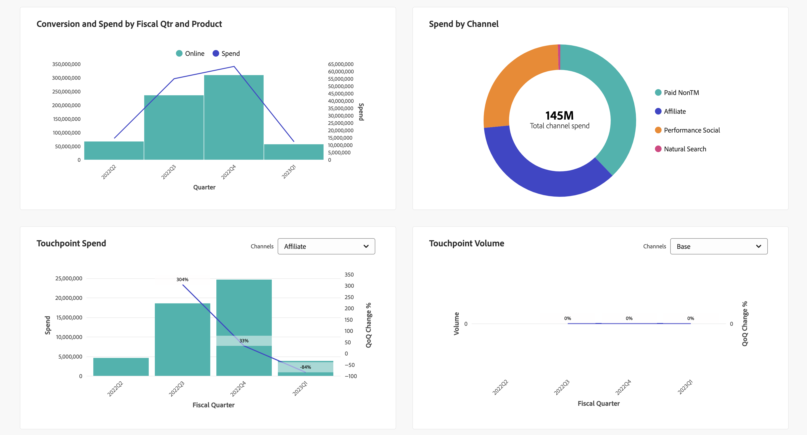

# モデルインサイト

モデルインサイトを表示するには、で  **[!UICONTROL Models]** Mix Modelerのインターフェイス：

1. から **[!UICONTROL Models]** テーブルで、を持つモデルの名前を選択します。 **[!UICONTROL Last run status]** 件中 ● **[!UICONTROL Success]**。

1. コンテキストメニューから、 **[!UICONTROL Model Insights]**.

指定したモデルが最後に更新された日時が表示され、次の 4 つのタブを使用してウィジェットが表示されます。 [モデルインサイト](#model-insights), [帰属](#attribution), [診断](#diagnostics)、および [履歴の概要](#historical-overview).

各タブのウィジェットの基になる期間を変更できます。 日付期間を入力または選択  日付の期間を選択します。

## [!UICONTROL Model insights]

「モデルインサイト」タブには、次のウィジェットが表示されます。

* 貢献度（日付およびベースメディア別） 積み重ねグラフは順序が付けられており、下部にベース、中央に非支出チャネル、上部に支出チャネルが表示されます。

* 貢献度（チャネル別）。

* マーケティング効果の概要。

* 限界応答曲線。
   「」からチャネルを選択 **[!UICONTROL Channel]** 特定のチャネルのウィジェットを更新するためのドロップダウンリスト。

各ウィジェットの個々のグラフ要素にポインタを合わせると、詳細を含むポップオーバーが表示されます。

ウィジェットのデータを含む CSV ファイルをダウンロードするには、次を選択します。 .

Microsoft® Excel 形式で完全なモデルインサイトデータをダウンロードするには、以下を選択します。  **[!UICONTROL Download data]**.

## [!UICONTROL Attribution]

使用， [!UICONTROL Attribution] タブをクリックすると、イベントレベルのデータを持つタッチポイントとマーケティングキャンペーンの効果を把握できます。 次のアトリビューションモデルがサポートされています。

* Mix Modelerで選択したモデルに基づく：
   * アルゴリズム – 影響
   * アルゴリズム – 増分
* ルールベース：
   * 減衰単位
   * ファーストタッチ
   * ラストタッチ
   * 線形
   * U字型

参照： [マルチタッチ属性](../get-started/about.md#multi-touch-attribution) Mix Modelerのマルチタッチアトリビューション機能の概要については、を参照してください。

から 1 つ以上のアトリビューションモデルを選択 **[!UICONTROL Attribution Model]** ドロップダウンリスト。 選択したアトリビューションモデルは、「アトリビューション」タブのすべてのウィジェットに適用されます。

Mix Modelerのマルチタッチ アトリビューションのきめ細かいイベントスコアは、全体的なMix Modelerスコアと ROI に一致します。 これらのスコアは、Experience Platformのデータセットとしても使用できます。

「アトリビューション」タブは、次のウィジェットで構成されます。

### [!UICONTROL Overview]

この [!UICONTROL Overview] ウィジェットには、選択したアトリビューションモデルに関して、コンバージョンの合計とパーセンテージが表示されます。 さらにモデルを選択すると、ビジュアライゼーションに円が追加され、凡例に対応する独自の色が付きます。

アトリビューションモデルの詳細を含むポップアップを表示するには、ビジュアライゼーションの任意の円にポインタを合わせます。

### [!UICONTROL Trends]

この [!UICONTROL Daily trends], [!UICONTROL Weekly trends]、または [!UICONTROL Monthly trends] ウィジェットには、選択したアトリビューションモデルの、日別、週別または月別のコンバージョントレンドが表示されます。

期間を選択するには、 **[!UICONTROL Daily trends]**, **[!UICONTROL Weekly trends]** または **[!UICONTROL Monthly trends]** から .

詳細を確認するには、特定のアトリビューションモデルのデータラインにカーソルを合わせると、そのデータのコンバージョンの合計数を表示するポップオーバーが表示されます。

### [!UICONTROL Breakdown]

この [!UICONTROL Breakdown] ウィジェットは、選択した各アトリビューションモデルのコンバージョンのチャネルまたはタッチポイントごとの分類です。 このウィジェットは、各チャネルまたはタッチポイントの有効性を決定するのに役立ちます。

分類タイプを選択するには、 **[!UICONTROL Breakdown by channel]** または **[!UICONTROL Breakdown by touchpoint]** から .

詳細を表示するには、任意のグラフ要素にポインタを合わせます。

### [!UICONTROL Top campaigns]

上位キャンペーン ウィジェットには、キャンペーン名、チャネル、メディアタイプおよび増分コンバージョン用の列を含んだ上位キャンペーンのテーブルが表示されます。 このウィジェットは、特定のチャネルに対する特定のキャンペーンの有効性をチームに伝え、さらに投資する必要があるキャンペーンに関するインサイトを提供するのに役立ちます。

チャネル、メディアタイプ、増分コンバージョンでテーブルを昇↑または降順に並べ替える↓合は、列ヘッダーを選択して並べ替えを切り替えます。

別のダイアログでテーブルを展開するには、を選択します。 **[!UICONTROL Expand]** から .

展開されたトップキャンペーン ダイアログには、と同じテーブルに対する追加列が表示されます

* 増分変換
* 影響コンバージョン
* ファーストタッチコンバージョン
* ラストタッチコンバージョン

  追加の各列ヘッダーを選択して、昇順または降順でテーブルを並べ替えることができます。

展開されたトップキャンペーン ダイアログを閉じるには、次を選択します **[!UICONTROL Close]**.

### [!UICONTROL Breakdown by touchpoint position]

この [!UICONTROL Breakdown by touchpoint position] ビジュアライゼーションは、すべてのコンバージョンパスをまたいだタッチポイントとタッチポイントの位置別に、アトリビューションコンバージョンを分類したものです。 このグラフは、タッチポイントが任意の位置の残りの位置や他のタッチポイントよりも、その位置での寄与が良いかどうかを比較するのに役立ちます。

>[!NOTE]
>
>すべてのタッチポイントおよびポジションにわたる属性モデルの貢献率の合計は、100 に等しくする必要があります。

職位 [!UICONTROL Starter], [!UICONTROL Player] および [!UICONTROL Closer] は次のように定義されます。

| 位置 | 説明 |
|---|---|
| [!UICONTROL Starter] | この位置は、タッチポイントがコンバージョンパスのファーストタッチであるかどうかを示します。 |
| [!UICONTROL Player] | この位置は、タッチポイントがコンバージョンにつながるファーストタッチまたはラストタッチでないかどうかを示します。 |
| [!UICONTROL Closer] | この位置は、タッチポイントがコンバージョン前のラストタッチであるかどうかを示します。 |

### [!UICONTROL Top conversion paths]

この [!UICONTROL Top conversion paths] ビジュアライゼーションには、選択したアトリビューションモデルに基づいて上位 5 つのコンバージョンパスが表示されます。

各コンバージョンパスには、以下が表示されます。

* 影響を与えるチャネルの数、
* 合計アトリビューションパス
* 合計アトリビューションパスに対する、このコンバージョンパスのアトリビューションパスの割合、
* チャネルごとに、アトリビューションモデルの貢献度のパーセンテージ、
* これらのチャネルアトリビューションモデルのコントリビューションパーセンテージの合計。

## [!UICONTROL Diagnostics]

「診断」タブには、次のウィジェットが表示されます。

* [!UICONTROL Model Assessment] ビジュアライゼーション。実際のコンバージョンと予測コンバージョンまたは残余コンバージョンを分類できます。

  ビジュアライゼーションを分類するには、以下を選択します。 **[!UICONTROL Actual vs. Predicted]** または **[!UICONTROL Residuals]** から **[!UICONTROL Breakdown]** リスト。

* [!UICONTROL Model fitting metrics] 各コンバージョン指標に関する次の列を示した表。

   * 実際の変換

   * モデル化された変換

   * 残差変換（実際の変換とモデル化された変換の差）

   * モデル品質スコア値：

      * R2 （R-2 乗）：回帰モデルに対するデータの適合度（適合度）を示します。

      * MAPE （平均絶対誤差率）：予測精度の測定に最も一般的に使用される KPI の 1 つで、予測誤差を実績値のパーセンテージで表します。

      * RMSE （二乗平均誤差）：誤差の二乗に従って重み付けされた、平均誤差を表示します。

  テーブルのデータを含む CSV ファイルをダウンロードするには、次を選択します .

* [!UICONTROL Touchpoint effectiveness] Attribution AIアルゴリズムモデルの結果を表すテーブル。 このテーブルのデータは、特定の期間のみ生成されます。 を選択 **[!UICONTROL As of *xx/xx/xx、xx:xx TZ *]** を参照してください。

  ビジュアライゼーションには、の降順で表示されます [!UICONTROL Efficiency measure] 、タッチポイントごとに：

   * [!UICONTROL Paths touched]：コンバージョンを達成するパスの割合とコンバージョンを達成しないパスの割合を視覚化します。 タッチポイントの場合、アトリビューションコンバージョン率が高いと、より多くのアトリビューションコンバージョンが表示されます。 この比率では、コンバージョンにつながるパスの割合と、コンバージョンにつながるパスの割合が比較されます *ではない* コンバージョンにつながります。
   * [!UICONTROL Efficiency measure]：アルゴリズムアトリビューションモデルによって生成される効率測定は、タッチポイント量に関係なく、コンバージョンに対するタッチポイントの相対的な重要度を示します。 効率は 1～5 のスケールで測定されます。 タッチポイント量が多いからといって、効率測定が高くなるとは限りません。
   * [!UICONTROL Total volume]：ユーザーがタッチポイントにタッチした合計回数。 この数は、コンバージョンを達成するパスとパスに現れるタッチポイントを含みます *ではない* その結果、コンバージョンが発生しました。

## [!UICONTROL Historical overview]

「履歴の概要」タブには、次のウィジェットが表示されます。

* コンバージョンと支出（会計四半期および製品別）。

* チャネル別の支出。

* タッチポイント支出。

  このウィジェットに表示する別の費用ベースのチャネルを選択できます。 チャネルを選択 **[!UICONTROL Channels]**.

* タッチポイント量。

  このウィジェットに表示する別のボリュームベースのチャネルを選択できます。 チャネルを選択 **[!UICONTROL Channels]**.

