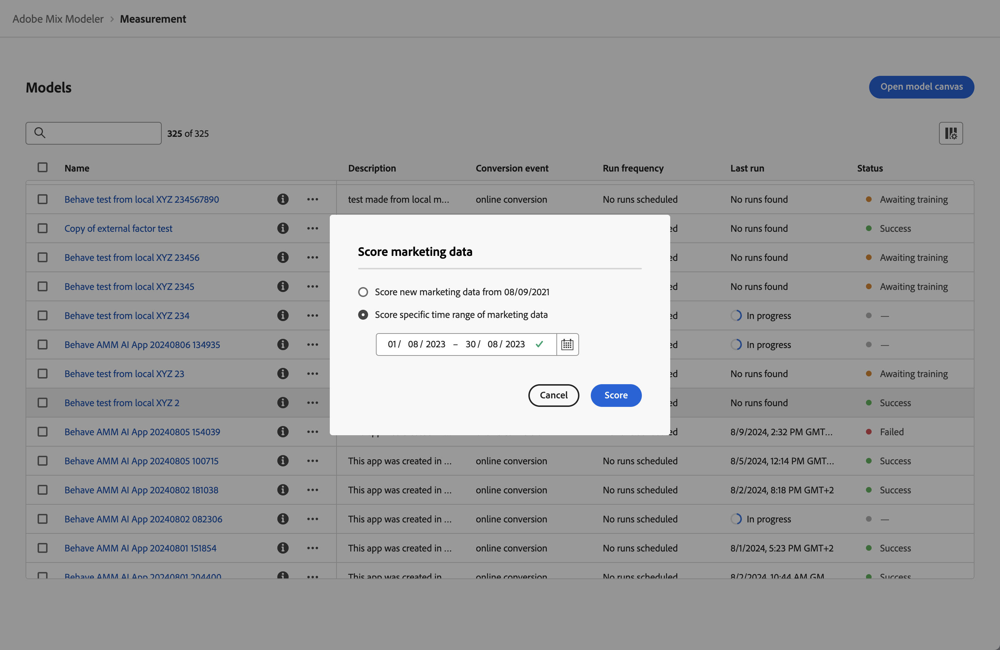

# モデルのトレーニングとスコアリング

モデルを[&#x200B; ビルド &#x200B;](/help/models/build.md)すると、モデルは自動的にトレーニングされ、スコアリングされます。 モデルを手動で再トレーニングまたは再スコアリングできます。

## トレーニング

新しい増分マーケティングおよび要因データを含める場合は、モデルを維持することを検討してください。 例えば、前四半期を通じて、市場動向が変化したり、マーケティングデータの分布が大幅に変化したりしました。

モデルを再トレーニングするには：

1. 左側のパネルから **[!UICONTROL Models]**&#x200B;を選択します。

1. モデルのを選択し、コンテキストメニューから&#x200B;**[!UICONTROL Train]**&#x200B;を選択します。 または、青いアクションバーから **[!UICONTROL Train]**&#x200B;を選択します。

   **[!UICONTROL Train model]** ダイアログで、次のオプションを選択します。

   * **[!UICONTROL Train model with last 2 years of marketing data]**、または
   * **[!UICONTROL Train model using specific date range of data]**.
日付範囲を指定します。 を使用して、日付範囲を選択できます。 1年以上のデータ範囲を選択する必要があります。

   

1. モデルを再トレーニングするには、**[!UICONTROL Train]**&#x200B;を選択します。

モデルが正常にトレーニングされた場合にのみ、モデルを再トレーニングできます。

## Score

新しいマーケティングデータにもとづいてモデルを段階的にスコアリングしたり、特定の日付範囲に合わせてモデルをスコアリングしたりできます。

次のような場合に、モデルのリスコアリングを検討します。

* 不正確なマーケティングデータの修正： 例えば、モデルのトレーニングとスコアリングに含めた最近の有料検索データは、1週間のデータを逃しました。
* 調整済みデータの一部として設定したデータセットの更新を通じて利用可能になった、新しい増分マーケティングデータを使用します。

モデルをスコアリングまたはリスコアリングするには：

1. 左側のパネルから **[!UICONTROL Models]**&#x200B;を選択します。

1. モデルのを選択し、コンテキストメニューから&#x200B;**[!UICONTROL Score]**&#x200B;を選択します。 または、青いアクションバーから **[!UICONTROL Score]**&#x200B;を選択します。

   **[!UICONTROL Score marketing data]** ダイアログで、次のオプションを選択します。

   * **[!UICONTROL Score new marketing data from *mm/dd/yyyy *]**、新しいマーケティングデータを使用してモデルを段階的にスコアリングする、または
   * 特定の日付範囲のコアを再コアする&#x200B;**[!UICONTROL Score specific date range of marketing data]**。
日付範囲を指定します。 を使用して、日付範囲を選択できます。

   

1. **[!UICONTROL Score]** を選択します。 特定のデータ範囲を使用してモデルをスコアリングする場合、**[!UICONTROL Existing model is replaced]** ダイアログが表示され、選択した日付範囲の新しいスコアでモデルを置き換えるかどうかを確認するように求められます。 確認するには、**[!UICONTROL Replace model]**&#x200B;を選択してください。

>[!IMPORTANT]
>
>モデルの再コアは、再スコアモデルに基づいて既に作成されているプランを変更しません。 プランで新しいスコアリングモデルを使用するには、新しいプランを作成する必要があります。
