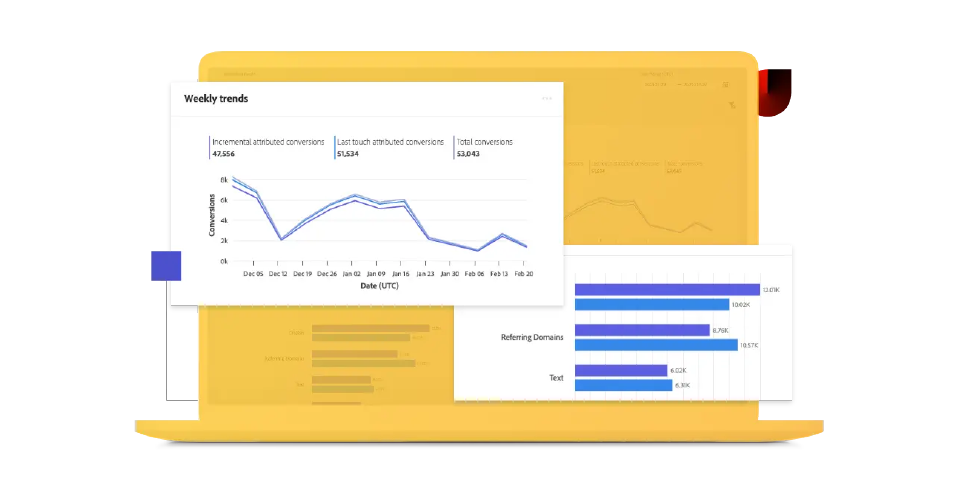

# Adobe Mix Modelerガイド

この技術ドキュメントガイドでは、Adobe **のMix Modeler** に関するセルフヘルプの支援を提供します。 Mix Modelerは、キャンペーンを測定し、有料、獲得、所有などのすべてのチャネルにわたって計画を総合的に最適化するAdobe Experience Cloud アプリケーションです。 Mix ModelerはAdobe Experience Platformをベースに構築され、Adobe Senseiを活用しています。

## 基本について学ぶ

<table style="table-layout:fixed">
  <tr style="border: 0;">
    <td>
    
    
<strong> クイックスタート </strong> Mix Modelerのワークフローの概要とインサイトを取得します。

    </td>
    <td>
    
    
<strong> データの取り込み </strong>  イベントおよび集計または概要データをMix Modelerに取り込む方法を説明します。

    </td>
    <td>
    
    
<strong> データの調和 </strong>  集計データとイベントデータを一貫性のあるデータビューに同化する方法を説明します。 
    

    </td>
    <td>
    
    
<strong> モデルとプラン </strong>  モデルのトレーニングとスコアリングを行い、マーケティングプランにインサイトを使用します。

    </td>
  </tr>
  <tr style="border: 0;">
    <td align="center"></td>
    <td align="center"></td>
    <td align="center"></td>
    <td align="center"></td>
    </tr>
</table>

## ドキュメントの参照

<table style="table-layout:fixed">
  <tr style="border: 0;">
    <td>
       
      <strong> データの取り込み </strong> <a href="/help/ingest-data/overview.md"> 概要 </a> - <a href="/help/ingest-data/schemas.md"> スキーマ </a> - <a href="/help/ingest-data/datasets.md"> データセット </a> 
    </td>
    <td>
       
      <strong> データの調和 </strong> <a href="/help/harmonize-data/overview.md"> 概要 </a> - <a href="/help/harmonize-data/fields.md"> フィールド </a> - <a href="/help/harmonize-data/dataset-rules.md"> データセットルール </a> - <a href="/help/harmonize-data/marketing-touchpoints.md"> マーケティングタッチポイント </a> - <a href="/help/harmonize-data/conversions.md"> コンバージョン </a> - <a href="/help/harmonize-data/usage-report.md"> 使用状況レポート </a>  
    </td>
    <td>
       
      <strong> モデル </strong> <a href="/help/models/overview.md"> 概要 </a> - <a href="/help/models/build.md"> モデルを作成 </a> - <a href="/help/models/insights.md"> モデルインサイト </a> - <a href="/help/models/scoring-data.md"> スコアリングデータの使用 </a>
    </td>
  </tr>
  <tr style="border: 0;">
    <td>
       
      <strong> 計画 </strong> <a href="/help/plans/overview.md"> 計画 </a> - <a href="/help/plans/build.md"> 計画の作成 </a> - <a href="/help/plans/compare.md"> 計画の比較 </a> - <a href="/help/plans/build.md"> インサイトの計画 </a>
    </td>
    <td>
       
      <strong> 概要 </strong> <a href="/help/dashboard/overview.md"> スキーマ </a> - <a href="/help/dashboard/harmonized-data.md"> 統一データ </a> - <a href="/help/dashboard/plans.md"> 計画 </a>
    </td>
        <td>
       
      <strong>Tutorials</strong> <a href="https://experienceleague.adobe.com/docs/mix-modeler-learn/tutorials/overview.html?lang=ja"> 概要 </a> - <a href="https://experienceleague.adobe.com/docs/mix-modeler-learn/tutorials/intro/use-cases.html?lang=en"> ユースケース </a> - <a href="https://experienceleague.adobe.com/docs/mix-modeler-learn/tutorials/intro/user-workflow.html?lang=ja"> ユーザーワークフロー </a> - <a href="https://experienceleague.adobe.com/docs/mix-modeler-learn/tutorials/intro/user-interface-tour.html?lang=ja"> ユーザーインターフェイスツアー </a>
    </td>
  </tr>
</table>
