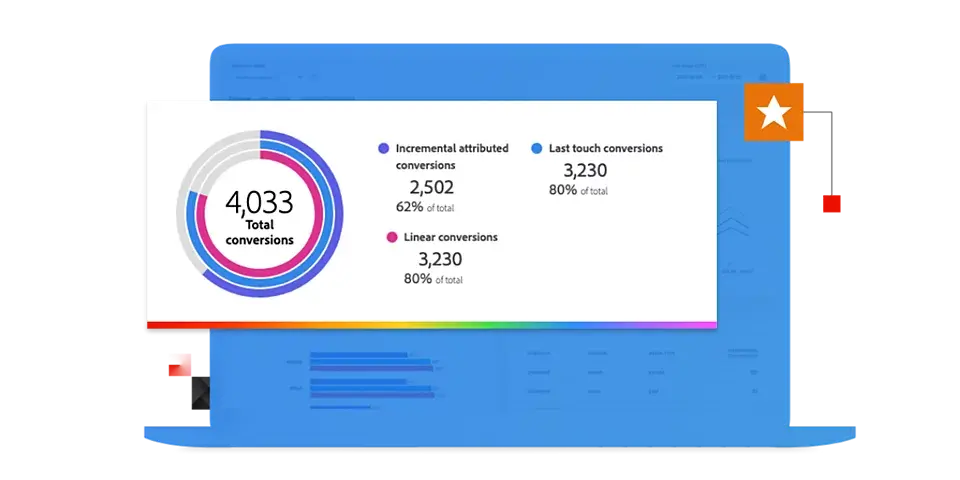

# Adobe Mix Modeler ガイド

このテクニカルドキュメントガイドでは、Adobe **Mix Modeler**&#x200B;に関するセルフヘルプを提供します。 Mix Modelerは、Adobe Experience Cloudのアプリケーションのひとつであり、ペイド、アーンド、オウンドのチャネルをまたいでキャンペーンを測定し、プランを包括的に最適化できます。 Mix Modelerは、Adobe Experience Platform上に構築され、Adobe Senseiを活用しています。

## 基本について学ぶ

<table style="table-layout:fixed">
  <tr style="border: 0;">
    <td>
    
    
<strong> クイックスタート </strong> とinsightの概要をMix Modelerのワークフローに取り込みます。

    </td>
    <td>
    
    
<strong> データの取り込み</strong>  イベントおよび集計データまたは概要データをMix Modelerに取り込む方法について説明します。

    </td>
    <td>
    
    
<strong> データの調和</strong> 集計データとイベントデータを一貫性のあるデータビューに統合する方法について説明します。 
    

    </td>
    <td>
    
    
<strong> モデルとプラン </strong>  モデルのトレーニングとスコアリングをおこない、インサイトをマーケティングプランに活用します。

    </td>
  </tr>
  <tr style="border: 0;">
    <td align="center"></td>
    <td align="center"></td>
    <td align="center"></td>
    <td align="center"></td>
    </tr>
</table>

## ドキュメントを見る

<table style="table-layout:fixed">
  <tr style="border: 0;">
    <td>
       
      <strong> データの取り込み</strong> <a href="/help/ingest-data/overview.md">概要</a> - <a href="/help/ingest-data/schemas.md"> スキーマ </a> - <a href="/help/ingest-data/datasets.md"> データセット </a> 
    </td>
    <td>
       
      <strong> データの調和</strong> <a href="/help/harmonize-data/overview.md">概要</a> - <a href="/help/harmonize-data/fields.md"> フィールド </a> - <a href="/help/harmonize-data/dataset-rules.md"> データセットルール </a> - <a href="/help/harmonize-data/marketing-touchpoints.md"> マーケティングのタッチポイント </a> - <a href="/help/harmonize-data/conversions.md"> コンバージョン </a> - <a href="/help/harmonize-data/usage-report.md">使用状況レポート </a>  
    </td>
    <td>
       
      <strong> モデル </strong> <a href="/help/models/overview.md">概要</a> - <a href="/help/models/build.md"> モデルを構築</a> - <a href="/help/models/insights.md"> モデルインサイト </a> - <a href="/help/models/scoring-data.md"> スコアリングデータを使用</a>
    </td>
  </tr>
  <tr style="border: 0;">
    <td>
       
      <strong> プラン </strong> <a href="/help/plans/overview.md"> プラン </a> - <a href="/help/plans/build.md"> プランを作成</a> - <a href="/help/plans/compare.md"> プランを比較</a> - <a href="/help/plans/build.md"> プランのインサイト </a>
    </td>
    <td>
       
      <strong>概要</strong> <a href="/help/dashboard/overview.md"> スキーマ </a> - <a href="/help/dashboard/harmonized-data.md">調和データ </a> - <a href="/help/dashboard/plans.md">計画</a>
    </td>
        <td>
       
      <strong> チュートリアル </strong> <a href="https://experienceleague.adobe.com/docs/mix-modeler-learn/tutorials/overview.html?lang=en">概要</a> - <a href="https://experienceleague.adobe.com/docs/mix-modeler-learn/tutorials/intro/use-cases.html?lang=en"> ユースケース </a> - <a href="https://experienceleague.adobe.com/docs/mix-modeler-learn/tutorials/intro/user-workflow.html?lang=en"> ユーザーワークフロー</a> - <a href="https://experienceleague.adobe.com/docs/mix-modeler-learn/tutorials/intro/user-interface-tour.html?lang=en"> ユーザーインターフェイスツアー</a>
    </td>
  </tr>
</table>
