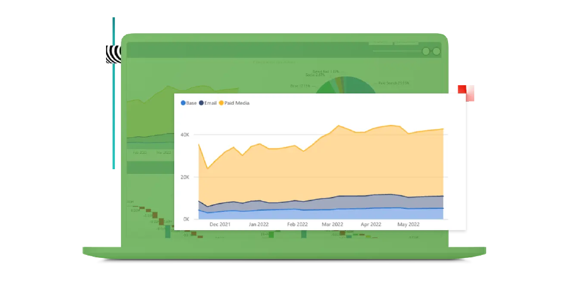

# Adobe Mix Modelerガイド

このテクニカルドキュメントガイドでは、Adobeに関するセルフサポートを提供します **Mix Modeler**. Mix Modelerは、キャンペーンを測定し、有料、獲得および所有のすべてのチャネルをまたいで計画を全体的に最適化するAdobe Experience Cloudアプリケーションです。 Mix ModelerはAdobe Experience Platformをベースに構築され、Adobe Senseiを活用しています。

## 基本について学ぶ

<table style="table-layout:fixed">
  <tr style="border: 0;">
    <td>
    
    
<strong>クイックスタート</strong> の概要と、ワークフローのワークフローに関するMix Modeler。

    </td>
    <td>
    
    
<strong>データの取り込み</strong> イベントを取り込み、イベントに集計または概要データをMix Modelerする方法を説明します。

    </td>
    <td>
    
    
<strong>データを調和させる</strong> 集計データとイベントデータを一貫したデータビューに同化する方法を説明します。 
    

    </td>
    <td>
    
    
<strong>モデルとプラン</strong> モデルのトレーニングとスコアリングをおこない、マーケティングプランにインサイトを使用します。

    </td>
  </tr>
  <tr style="border: 0;">
    <td align="center"></td>
    <td align="center"></td>
    <td align="center"></td>
    <td align="center"></td>
    </tr>
</table>

## ドキュメントの参照

<table style="table-layout:auto">
  <tr style="border: 0;">
    <td>
       
      <strong>データの取り込み</strong> <a href="/help/ingest-data/overview.md">概要</a> - <a href="/help/ingest-data/schemas.md">スキーマ</a> - <a href="/help/ingest-data/datasets.md">データセット</a> 
    </td>
    <td>
       
      <strong>データを調和させる</strong> <a href="/help/harmonize-data/overview.md">概要</a> - <a href="/help/harmonize-data/fields.md">フィールド</a>  - <a href="/help/harmonize-data/dataset-rules.md">データセットルール</a> - <a href="/help/harmonize-data/marketing-touchpoints.md">マーケティングタッチポイント</a> - <a href="/help/harmonize-data/conversions.md">コンバージョン</a> - <a href="/help/harmonize-data/usage-report.md">使用状況レポート</a>  
    </td>
    <td>
       
      <strong>モデル</strong> <a href="/help/models/overview.md">概要</a> - <a href="/help/models/create.md">モデルの作成</a> - <a href="/help/models/insights.md">モデルインサイト</a> - <a href="/help/models/scoring-data.md">スコアリングデータ</a>
    </td>
  </tr>
  <tr style="border: 0;">
    <td>
       
      <strong>プラン</strong> <a href="/help/plans/overview.md">プラン</a> - <a href="/help/plans/create.md">プランの作成</a> - <a href="/help/plans/compare.md">プランの比較</a> - <a href="/help/plans/edit.md">プランの編集</a>
    </td>
    <td>
       
      <strong>概要</strong> <a href="/help/dashboard/overview.md">スキーマ</a> - <a href="/help/dashboard/harmonized-data.md">調整済みデータ</a> - <a href="/help/dashboard/plans.md">プラン</a>
    </td>
        <td>
       
      <strong>Tutorials</strong> <a href="https://experienceleague.adobe.com/docs/mix-modeler-learn/tutorials/overview.html?lang=en">概要</a> - <a href="https://experienceleague.adobe.com/docs/mix-modeler-learn/tutorials/intro/use-cases.html?lang=en">使用例</a> - <a href="https://experienceleague.adobe.com/docs/mix-modeler-learn/tutorials/intro/user-workflow.html?lang=en">ユーザーワークフロー</a>  - <a href="https://experienceleague.adobe.com/docs/mix-modeler-learn/tutorials/intro/user-interface-tour.html?lang=en">ユーザーインターフェイスツアー</a>
    </td>
  </tr>
</table>
