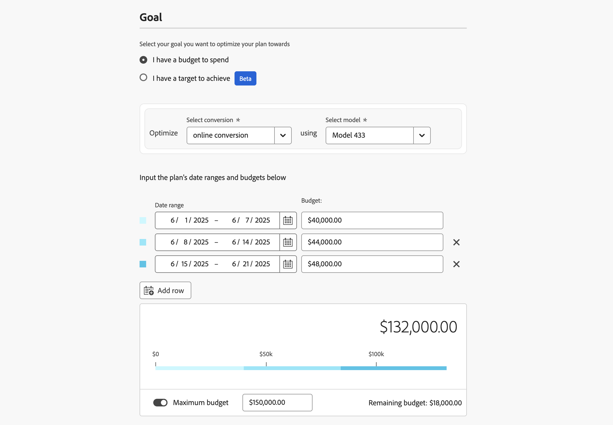
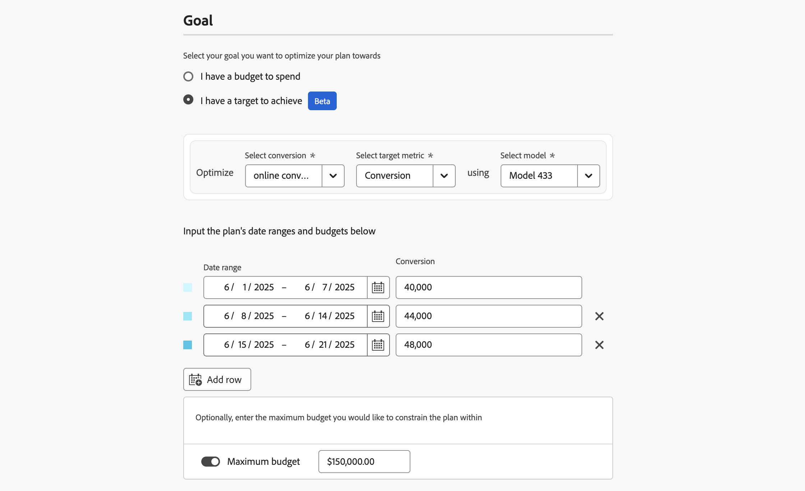
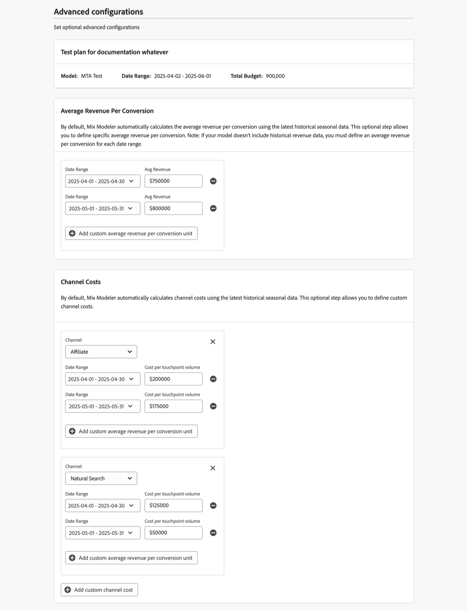

# プランの構築

Mix Modelerでは、プラン ウィザードを使用してプランを作成します。 プラン ウィザードでは、プランの詳細、予算、またはターゲット指標と、プランに使用する基本モデルを設定できます。 詳細、予算、ターゲット指標、モデルを指定したら、AIが推奨するプランに進むか、チャネルごとに支出を編集することができます。 コンバージョンおよびチャネルコストあたりの平均売上に関する高度な設定を定義するオプションがあります。

プランを最大化する目標を定義する必要があります。 この目標には、予算や達成したい目標を設定できます。 目標がターゲットの場合は、さらに、使用するターゲット指標の値（コンバージョン、収益、CPA、ROI）を指定する必要があります。

プランを作成するには、Mix Modelerの **[!UICONTROL Plans]** インターフェイスで「**[!UICONTROL Create plan]**」を選択します。

1. **[!UICONTROL Plan creation]**&#x200B;画面で次の操作を行います。

   1. **[!UICONTROL Setup]** セクション：

      1. **[!UICONTROL Plan name]**&#x200B;を入力します（例：`Goal based plan`）。 **[!UICONTROL Description]**&#x200B;を入力します（例：`A goal based plan`）。
      1. **[!UICONTROL _から&#x200B;**[!UICONTROL Model]**を選択します。オプションを選択してください。_.]**

         

   1. 「**[!UICONTROL Goal]**」セクションで、プランを最適化する目標を選択します。 次のいずれかを選択できます

      * **[!UICONTROL I have a budget to spend]**

        

        このオプションを使用すると、1つ以上の日付範囲の予算を入力できます。

         1. **[!UICONTROL Optimize]** コンテナ内：
            1. **[!UICONTROL Select conversion]** ドロップダウンメニューからコンバージョンを選択します。
            1. **[!UICONTROL Select model]** ドロップダウンメニューからモデルを選択します。
         1. 日付を入力するか、を使用して日付範囲を選択して、**[!UICONTROL Date range]**&#x200B;を指定します。
         1. **[!UICONTROL Budget]**を入力します。
各予算を含む日付範囲を追加するには、 **[!UICONTROL Add row]**を選択します。
日付範囲と関連する予算を削除するには、を選択します。
         1. プランを制限するオプションの最大予算を定義するには、次の手順を実行します。
            1. **[!UICONTROL Maximize budget]**&#x200B;を切り替えます。
            1. 予算の最大額を指定します。 金額は、日付範囲に指定された予算の合計金額と同じか、それ以上である必要があります。

      * **[!UICONTROL I have a target to achieve]** [!BADGE Beta]

        

         1. **[!UICONTROL Optimize]** コンテナ内
            1. **[!UICONTROL Select conversion]** ドロップダウンメニューからコンバージョンを選択します。
            1. **[!UICONTROL Select target metric]** ドロップダウンメニューからターゲット指標を選択します。 **[!UICONTROL Conversion]**、**[!UICONTROL CPA]**、**[!UICONTROL Revenue]**&#x200B;または&#x200B;**[!UICONTROL ROI]**&#x200B;のいずれかを選択できます。
            1. **[!UICONTROL Select model]** ドロップダウンメニューからモデルを選択します。
         1. 日付を入力するか、を使用して日付範囲を選択して、日付範囲を指定します。
         1. 選択したターゲット指標の値を入力します。 例えば、**[!UICONTROL Total Conversions]**&#x200B;の数値、**[!UICONTROL Paid Marketing ROI]**&#x200B;の割合、**[!UICONTROL Paid Marketing CPA]**&#x200B;と&#x200B;**[!UICONTROL Total Revenue]**の通貨値などです。
ターゲット指標を含む日付範囲を追加するには、 **[!UICONTROL Add row]**を選択します。
日付範囲と関連するターゲット指標を削除するには、を選択します。
         1. プランを制限するオプションの最大予算を定義するには、次の手順を実行します。
            1. **[!UICONTROL Maximize budget]**&#x200B;を切り替えます。
            1. 予算の最大額を指定します。

   1. **[!UICONTROL Next]** を選択します。

1. **[!UICONTROL Done with all required fields]** ダイアログで、次の操作を行います。

   

   * 予測ROIでAI推奨プランを生成する場合は、 **[!UICONTROL Create plan now]**&#x200B;を選択します。 **[!UICONTROL OK]** を選択します。 プランが作成されました。

   * 予測ROIを含むプランを作成する前に、チャネルの予算を編集し、高度な設定を定義する場合は、 **[!UICONTROL Edit channel budgets first]**&#x200B;を選択します。  **[!UICONTROL OK]**&#x200B;を選択すると、次の手順で&#x200B;**[!UICONTROL Spend selection]**&#x200B;でのチャネル支出を定義できます。

     >[!IMPORTANT]
     >
     >以下の情報は、 **[!UICONTROL Edit channel budgets first]**&#x200B;を選択した場合にのみ関連します

1. **[!UICONTROL Spend selection]** セクションで、予算日付範囲ごとにを使用して、そのデータ範囲のチャネル配布ビューを開きます。

   過去のマーケティング費用データとインサイトを使用したい場合は、過去の参照データを使用できます。 過去の参照データを次の目的のために考慮する：

   * パフォーマンスの高いチャネルと低いチャネルを強調することで、予算配分を改善します。
   * 傾向分析のサポート：
   * 効果的な戦略を特定し、計画を立てる際の失敗を回避する。

   過去の参照期間を選択すると、以前の支出パターンの環境設定に合わせて、Mix Modelerのプランニング機能で期待内のプランを作成できます。 これらの計画は、最終的に関係者の信頼を高め、マーケティングプランが戦略的かつ効率的であり、実績のあるパフォーマンスデータとビジネスニーズに基づいていることを確認する必要があります。

   

   1. 「**[!UICONTROL Spend pattern]**」を選択します。

      * 既定のオプションは&#x200B;**[!UICONTROL Automatic]**&#x200B;です。
      * **[!UICONTROL Historical reference]**&#x200B;を選択し、**[!UICONTROL Start date]**&#x200B;を入力して、Mix Modelerで既に利用可能な過去のマーケティング費用データを参照します。 **[!UICONTROL End date]**&#x200B;は、支出パターンを定義する日付範囲に基づいて自動的に決定されます。 提案された開始日は、利用可能な過去のマーケティング費用の最初の開始日です。 存在しない履歴または無効な履歴の参照期間を選択したことを示すには、が表示されます。

   1. 各チャネルの予算を定義するには、**[!UICONTROL Min]**&#x200B;と&#x200B;**[!UICONTROL Max]**&#x200B;の値を入力するか、スライダーを使用します。

   1. 通貨またはパーセント入力を切り替えるには、**[!UICONTROL View spend by]**&#x200B;の&#x200B;**[!UICONTROL $]**&#x200B;または&#x200B;**[!UICONTROL %]**&#x200B;を選択します。 通貨ベースではないターゲット指標を選択した場合、この切り替えは無効になります。

   1. 終了したら「**[!UICONTROL Create]**」を選択します。
      

   1. **[!UICONTROL Next]** を選択します。

1. 「**[!UICONTROL Advanced configurations]**」セクションに、オプションの詳細設定を入力できます。

   

   * プラン名、モデル、日付範囲、総予算が要約されます。

   * デフォルトでは、Mix Modelerは最新の過去の季節データを使用して、コンバージョンあたりの平均売上を自動的に計算します。 **[!UICONTROL Average Revenue per conversion]**&#x200B;では、コンバージョンあたりの平均売上を定義できます。

      1. 予算内の各日付範囲について：

         1. **[!UICONTROL Date range]** ドロップダウンメニューから日付範囲を選択します。
         1. **[!UICONTROL Average revenue]**&#x200B;値を入力してください。

      1. 「」を選択して、コンバージョン単位ごとのカスタム平均収益を追加し、日付範囲を追加します。
      1. 日付範囲を削除するには、を選択します。

     >[!NOTE]
     >
     >モデルに過去の売上データが含まれていない場合は、予算に指定した日付範囲ごとに、コンバージョンあたりの平均売上を定義する必要があります。
     >

   * デフォルトでは、Mix Modelerは最新の過去の季節データを使用してチャネルコストを自動的に計算します。 **[!UICONTROL Channel costs]**&#x200B;では、カスタムチャネルコストを定義できます。

      1. モデルの各チャネルに対して、カスタムチャネルコストを定義します。

         1. **[!UICONTROL Channel]** ドロップダウンメニューからチャネルを選択します。
         1. 予算内の各日付範囲について：
            1. **[!UICONTROL Date range]** ドロップダウンメニューから日付範囲を選択します。
            1. **[!UICONTROL Average revenue]**&#x200B;値を入力してください。
         1. 日付範囲を追加するには、 **[!UICONTROL Add custom average revenue per conversion unit]**&#x200B;を選択します。
         1. 日付範囲を削除するには、を選択します。

      1. チャネルを追加するには、 **[!UICONTROL Add custom channel cost]**&#x200B;を選択します。
      1. カスタムチャネルを削除するには、を選択します。

1. 終了したら「**[!UICONTROL Create]**」を選択します。

1. **[!UICONTROL Create plan]** ダイアログで、**[!UICONTROL Create plan]**&#x200B;を選択してプランを作成します。 プランの作成をキャンセルするには、**[!UICONTROL Cancel]**&#x200B;を選択します。 確認する&#x200B;**[!UICONTROL No work is saved]** ダイアログが表示されます。

