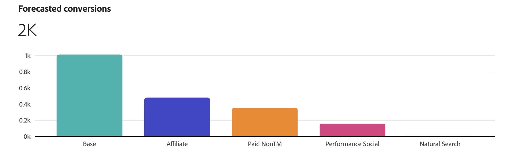
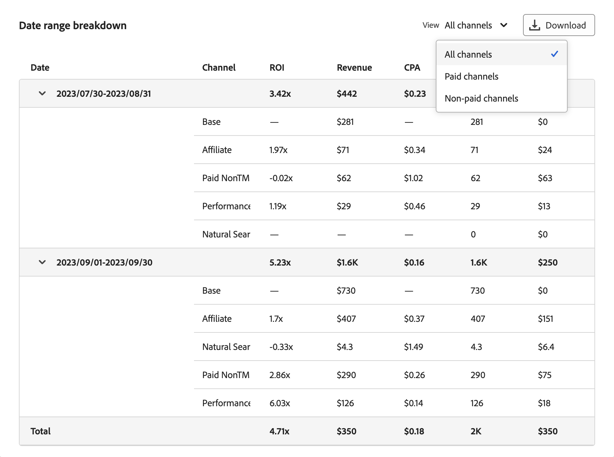

# プランインサイト

[!UICONTROL Plan insights] では、プランのインサイトが作成され、プランのベースとなる [!UICONTROL Model]、[!UICONTROL Data range] および [!UICONTROL Total budget] が表示されます。

取得が完了すると、プランの概要が次の内容で表示されます。

- [!UICONTROL Forecasted paid channel ROI] ビジュアライゼーション
- [!UICONTROL Forecasted revenue] ビジュアライゼーション
- [!UICONTROL Forecasted conversion] ビジュアライゼーション
- [!UICONTROL Marginal channel return] ビジュアライゼーション
- 計画の [!UICONTROL Data range breakdown] の表、次の列が表示されています

   - チャネル
   - ROI
   - 公認会計士
   - 収益
   - コンバージョン目標
   - 費用

インターフェイスを閉じるには、「**[!UICONTROL Close]**」を選択します。

プランの ROI の表示方法を変更するには、**[!UICONTROL View ROI]** で **[!UICONTROL X]** または **[!UICONTROL  %]** を選択します。

## 予測された有料チャネル支出と ROI

このビジュアライゼーションでは、モデル、日付範囲、予算に基づいて、有料チャネルのフォーキャスト費用と投資回収率の散布図が表示されます。

## 予測収益

この棒グラフビジュアライゼーションには、モデル、日付範囲、予算に基づいて、チャネルの予測収益が表示されます。

## 予測コンバージョン

この棒グラフビジュアライゼーションは、モデル、日付範囲および予算に基づいて、チャネルの予測コンバージョンを表示します。

## マージナルチャネル再来訪

この折れ線グラフビジュアライゼーションには、選択したチャネルのマージナル帰還曲線と、**[!UICONTROL Marginal break-even]** と **[!UICONTROL Return point]** のインジケーターが表示されます。 このビジュアライゼーションは、チャネルの支出が限界損益分岐点にどのように到達しているか、およびチャネルの支出を増やす余地があるか、またはチャネルの支出効率を向上させるためにチャネルへの支出を減らす必要があるかを理解するのに役立ちます。

ビジュアライゼーションの特定のチャネルを選択するには、チャネル ドロップダウ **[!UICONTROL View]** メニューからチャネルを選択します。

## 日付範囲の分類

[!UICONTROL Date range breakdown] の表には、[!UICONTROL ROI]、[!UICONTROL Revenue]、[!UICONTROL CPA]、[!UICONTROL Conversions] および [!UICONTROL Spend] のチャネルごとの詳細な詳細データが表示されます。

1. 日付範囲の分類のデータを含んだ CSV ファイルをダウンロードするには、「」 **[!UICONTROL Download CSV]** 選択します。 コンテキストメニューから、次の操作を行います。

   - CSV 形式の詳細なデータについては、「」 **[!UICONTROL Detailed CSV]** を選択してください。
   - CSV 形式の概要データの場合は、「」 **[!UICONTROL Summary CSV]** を選択します。

   詳細データは、週別にキー設定された粒度の高いデータです。 概要データは、モデルが指定した日付範囲でキー設定されたデータです。

1. チャネルのカテゴリ別に日付範囲の分類を表示するには、「**[!UICONTROL View]**」の選択から「**[!UICONTROL All channels]**」、「**[!UICONTROL Paid channels]**」または「**[!UICONTROL Non-paid channels]**」を選択します。

## プランを編集

1. プランを編集するには、「」を選択します **[!UICONTROL Edit plan]**

   1. **[!UICONTROL Spend selection]** セクションの各予算の日付範囲で、 を使用して、そのデータ範囲のチャネル配分表示を開きます。

   1. 各チャネルの予算を変更するには、「**[!UICONTROL Min]**」と「**[!UICONTROL Max]**」の値を変更するか、スライダーを使用します。

   1. 通貨またはパーセンテージの入力を切り替えるには、「**[!UICONTROL View spend by]**」で「**[!UICONTROL $]**」または「**[!UICONTROL %]**」を選択します。

      

   1. プランの詳細を編集するには、**[!UICONTROL Edit details]** を選択します。

      1. 「**[!UICONTROL Setup]**」セクションで、「**[!UICONTROL Plan name]**」と「**[!UICONTROL Description]**」を変更します（該当する場合）。

      1. **[!UICONTROL Budget]** のセクションで以下を実行します。

         1. 日付を入力するか、 を使用して日付範囲を選択して、1 つ以上のプランの日付範囲の **[!UICONTROL Date range]** を変更します。

         1. 1 つ以上のプランの日付範囲の **[!UICONTROL Budget]** を変更します。

         日付範囲を追加するには、それぞれ予算と共に  **[!UICONTROL Add row]** を選択します。

         日付範囲および関連する予算を削除するには、「」を選択します。

         最大予算を定義する手順は、次のとおりです。

         1. **[!UICONTROL Maximize budget]** をオンにします。
         1. 最大予算の金額を指定してください。 金額は、日付範囲に指定された予算の合計金額以上である必要があります。

      1. 「**[!UICONTROL Next]**」を選択すると、「**[!UICONTROL Spend]**」セクションに戻ります。 「**[!UICONTROL Cancel]**」を選択して、計画の概要に戻ります。

         

   1. プランの詳細設定を定義した場合は、「**[!UICONTROL Next]**」を選択します。

      

      - 計画名、モデル、日付範囲および予算合計が要約されます。

      - デフォルトでは、Mix Modelerは、最新の季節的な履歴データを使用して、コンバージョンあたりの平均売上高を自動計算します。 で **[!UICONTROL Average Revenue per conversion]**、コンバージョンごとの特定の平均売上高を定義できます。

         1. 予算の日付範囲ごとに、次の操作を行います。
            1. **[!UICONTROL Date range]** ドロップダウンメニューから日付範囲を選択します。
            1. **[!UICONTROL Average revenue]** 値を入力します。

         1. 「」を選択し、コンバージョン単位あたりのカスタム平均売上高を追加して、日付範囲を追加します。
         1.  を選択して、日付範囲を削除します。

        >[!NOTE]
        >
        >モデルに収益履歴データが含まれていない場合は、予算に指定した日付範囲ごとに、コンバージョンごとの平均売上高を定義する必要があります。
        >

      - デフォルトでは、Mix Modelerは、最新の季節別の履歴データを使用してチャネルコストを自動計算します。 **[!UICONTROL Channel costs]** の中で、カスタムチャネルのコストを定義できます。

         1. モデルのチャネルごとに、カスタムチャネルコストを定義します。
            1. **[!UICONTROL Channel]** ドロップダウンメニューからチャネルを選択します。
            1. 予算の日付範囲ごとに、次の操作を行います。
               1. **[!UICONTROL Date range]** ドロップダウンメニューから日付範囲を選択します。
               1. **[!UICONTROL Average revenue]** 値を入力します。
            1.  **[!UICONTROL Add custom average revenue per conversion unit]** を選択して、日付範囲を追加します。
            1.  を選択して、日付範囲を削除します。

         1.  **[!UICONTROL Add custom channel cost]** を選択して、チャンネルを追加します。
         1.  を選択して、カスタムチャネルを削除します。

1. 計画の編集が終了したら、「**[!UICONTROL Edit]**」を選択します。

   **[!UICONTROL All changes are final]** ダイアログで、「**[!UICONTROL OK]**」を選択して、プランの現在の支出配分と ROI および収益予測を更新します。 「**[!UICONTROL Cancel]**」を選択して、プランの更新をキャンセルします。

1. プランの更新をキャンセルするには、「**[!UICONTROL Cancel]**」を選択します。

   **[!UICONTROL No work will be saved]** ダイアログで、「**[!UICONTROL Cancel]**」を選択してプランの作業を続行するか、「**[!UICONTROL OK]**」を選択してプランインターフェイスに戻ります。
