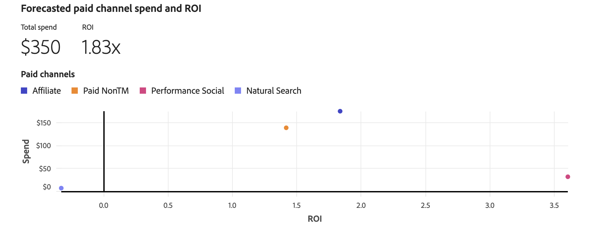
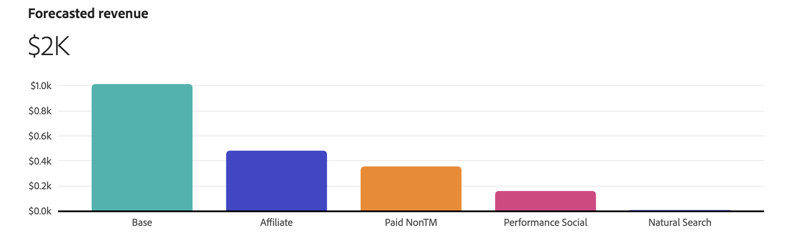
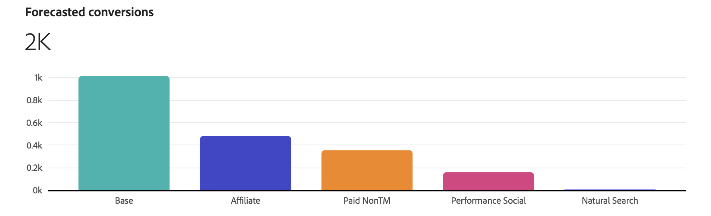
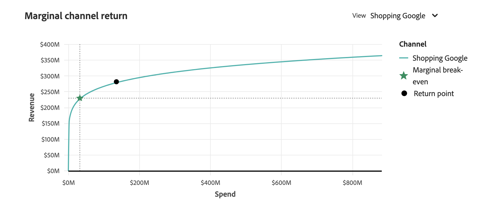
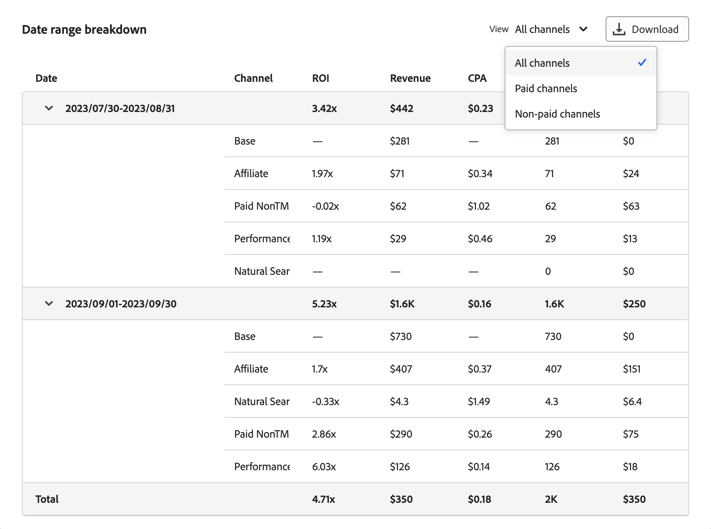
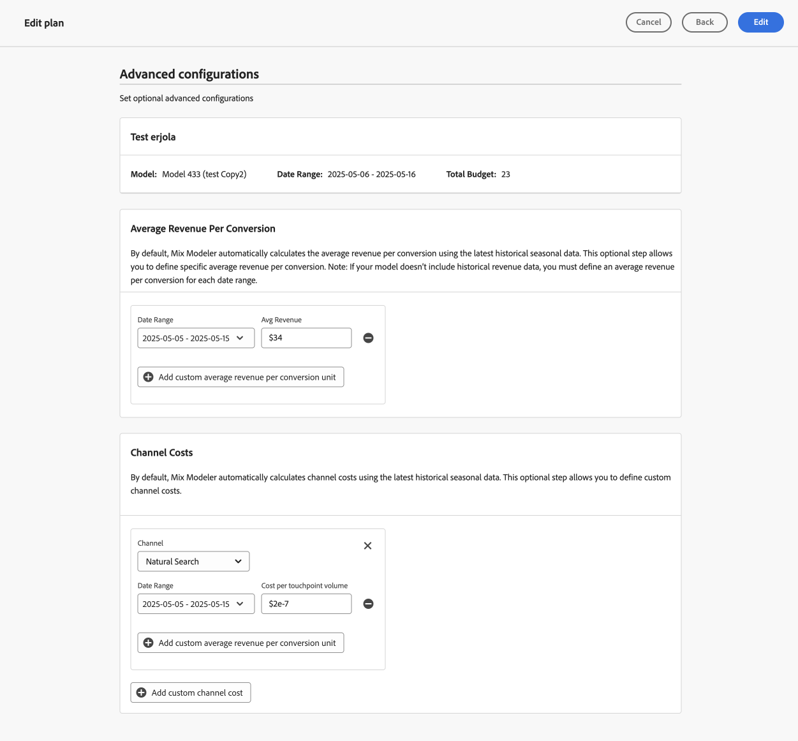

# プランインサイト

[!UICONTROL Plan insights]では、プランのインサイトが作成され、プランの基礎となる[!UICONTROL Model]、[!UICONTROL Data range]、および[!UICONTROL Plan target]が表示されます。

インサイトが作成されると、次の内容で構成されるプランの概要が表示されます。

- プランのベースとなる[!UICONTROL Model]、[!UICONTROL Data range]および[!UICONTROL Plan target]を表示するヘッダー。
   - 目標ベースのプランを定義した場合、バッジはターゲットのステータスを示します。考えられるオプションは次のとおりです。

      - [!BADGE 達成可能な目標]{type=Positive}
      - [!BADGE 目標は達成不能]{type=Negative}

   - 詳細を表示するには、 **[!UICONTROL Show more]**&#x200B;を選択します。

- [[!UICONTROL Forecasted paid channel ROI] ビジュアライゼーション](#forecasted-paid-channel-spend-and-roi)
- [[!UICONTROL Forecasted revenue] ビジュアライゼーション](#forecasted-revenue)
- [[!UICONTROL Forecasted conversion] ビジュアライゼーション](#forecasted-conversions)
- [[!UICONTROL Marginal channel return] ビジュアライゼーション](#marginal-channel-return)
- プラン ](#date-range-breakdown)の[[!UICONTROL Data range breakdown] テーブル。の列が表示されます

   - チャネル
   - ROI
   - CPA
   - 売上高
   - コンバージョン目標
   - 支出

インターフェイスを閉じるには、**[!UICONTROL Close]**&#x200B;を選択します。

プランのROIの表示方法を変更するには、**[!UICONTROL View ROI]**&#x200B;で&#x200B;**[!UICONTROL X]**&#x200B;または&#x200B;**[!UICONTROL  %]**&#x200B;を選択します。

## 予測されたペイドチャネルの支出とROI

このビジュアライゼーションでは、モデル、日付範囲、予算に基づいて、有料チャネルでの予測支出と投資回収率の散布図を示します。

## 売上予測

モデル、日付範囲、予算にもとづいた、チャネルの売上予測を棒グラフで視覚化します。

## 予測コンバージョン

モデル、日付範囲、予算にもとづいて、チャネルで予測されるコンバージョンを示す棒グラフのビジュアライゼーション。

## 限界チャネルリターン

この折れ線グラフのビジュアライゼーションは、選択したチャネルの限界返品曲線を&#x200B;**[!UICONTROL Marginal break-even]**&#x200B;と&#x200B;**[!UICONTROL Return point]**&#x200B;の指標とともに表示します。 このビジュアライゼーションは、チャネルへの支出が、限界損益分岐点にどのように達しているかを把握するのに役立ちます。 また、チャネルの支出額を増やす余地があるのか、チャネルの支出効率を向上させるために、チャネルへの支出額を減らす必要があるのかなど、

ビジュアライゼーションの特定のチャネルを選択するには、**[!UICONTROL View]** ドロップダウンメニューからチャネルを選択します。

## チャネルシナジー

チャネルシナジー行列は、マーケティングチャネルが個々の貢献を超えて、乗法効果を作成するためにどのように相互作用するかを特定するのに役立ちます。

行列を表すCSV ファイルをダウンロードするには、 **[!UICONTROL Download]**&#x200B;を選択します。

## 日付範囲の分類

[!UICONTROL Date range breakdown] テーブルには、[!UICONTROL ROI]、[!UICONTROL Revenue]、[!UICONTROL CPA]、[!UICONTROL Conversions]および[!UICONTROL Spend]のチャネルごとの詳細なデータが表示されます。

1. 日付範囲の内訳のデータを含むCSV ファイルをダウンロードするには、 **[!UICONTROL Download CSV]**&#x200B;を選択します。 コンテキストメニューから：

   - CSV形式の詳細データについては、 **[!UICONTROL Detailed CSV]**&#x200B;を選択してください。
   - CSV形式の概要データの場合は、 **[!UICONTROL Summary CSV]**&#x200B;を選択します。

   詳細データは、週ごとにキーイングされた詳細なデータです。 概要データは、モデルが提供する日付範囲でキーを設定されたデータです。

1. チャネルのカテゴリ別の日付範囲の内訳を表示するには、**[!UICONTROL View]**&#x200B;選択範囲から&#x200B;**[!UICONTROL All channels]**、**[!UICONTROL Paid channels]**&#x200B;または&#x200B;**[!UICONTROL Non-paid channels]**&#x200B;を選択します。

## プランを編集

プランを編集するには、 **[!UICONTROL Edit plan]**&#x200B;を選択します。

1. **[!UICONTROL Spend selection]** セクションで、予算日付範囲ごとにを使用して、そのデータ範囲のチャネル配布ビューを開きます。

   過去のマーケティング費用データとインサイトを使用したい場合は、過去の参照データを使用できます。 過去の参照データを次の目的のために考慮する：

   - パフォーマンスの高いチャネルと低いチャネルを強調することで、予算配分を改善します。
   - 傾向分析のサポート：
   - 効果的な戦略を特定し、計画を立てる際の失敗を回避する。

   過去の参照期間を選択すると、以前の支出パターンの環境設定に合わせて、Mix Modelerのプランニング機能で期待内のプランを作成できます。 これらの計画は、最終的に関係者の信頼を高め、マーケティングプランが戦略的かつ効率的であり、実績のあるパフォーマンスデータとビジネスニーズに基づいていることを確認する必要があります。

   

   1. 「**[!UICONTROL Spend pattern]**」を選択します。

      - 既定のオプションは&#x200B;**[!UICONTROL Automatic]**&#x200B;です。
      - **[!UICONTROL Historical reference]**&#x200B;を選択し、**[!UICONTROL Start date]**&#x200B;を入力して、Mix Modelerで既に利用可能な過去のマーケティング費用データを参照します。 **[!UICONTROL End date]**&#x200B;は、選択したデータ範囲に基づいて自動的に決定されます。 提案開始日は、利用可能な過去のマーケティング費用データの中で最初に利用可能なものです。 存在しない履歴参照期間を選択したことを示すには、が表示されます。

   1. 各チャネルの予算を変更するには、**[!UICONTROL Min]**&#x200B;と&#x200B;**[!UICONTROL Max]**&#x200B;の値を変更するか、スライダーを使用します。

   1. 通貨またはパーセント入力を切り替えるには、**[!UICONTROL View spend by]**&#x200B;の&#x200B;**[!UICONTROL $]**&#x200B;または&#x200B;**[!UICONTROL %]**&#x200B;を選択します。

   1. プランの詳細を編集するには、**[!UICONTROL Edit details]**&#x200B;を選択します。

      1. **[!UICONTROL Setup]** セクション：

         1. **[!UICONTROL Plan name]**&#x200B;を入力します（例：`Demo plan`）。 **[!UICONTROL Description]**&#x200B;を入力します（例：`Demo plan for Luma company`）。
         1. **[!UICONTROL _から&#x200B;**[!UICONTROL Model]**を選択します。オプションを選択してください。_.]**

            

      1. 「**[!UICONTROL Goal]**」セクションで、プランを最適化する目標を選択します。 次のいずれかを選択できます
         - **[!UICONTROL I have a budget to spend]**

           

           このオプションを使用すると、1つ以上の日付範囲の予算を入力できます。

            1. **[!UICONTROL Optimize]** コンテナ内：
               1. **[!UICONTROL Select conversion]** ドロップダウンメニューからコンバージョンを選択します。
               1. **[!UICONTROL Select model]** ドロップダウンメニューからモデルを選択します。
            1. 日付を入力するか、を使用して日付範囲を選択して、**[!UICONTROL Date range]**&#x200B;を指定します。
            1. **[!UICONTROL Budget]**を入力します。
各予算を含む日付範囲を追加するには、 **[!UICONTROL Add row]**を選択します。
日付範囲と関連する予算を削除するには、を選択します。
            1. プランを制限するオプションの最大予算を定義するには、次の手順を実行します。
               1. **[!UICONTROL Maximize budget]**&#x200B;を切り替えます。
               1. 予算の最大額を指定します。 金額は、日付範囲に指定された予算の合計金額と同じか、それ以上である必要があります。

         - **[!UICONTROL I have a target to achieve]** [!BADGE Beta]

           

            1. **[!UICONTROL Optimize]** コンテナ内
               1. **[!UICONTROL Select conversion]** ドロップダウンメニューからコンバージョンを選択します。
               1. **[!UICONTROL Select target metric]** ドロップダウンメニューからターゲット指標を選択します。 **[!UICONTROL Conversion]**、**[!UICONTROL CPA]**、**[!UICONTROL Revenue]**&#x200B;または&#x200B;**[!UICONTROL ROI]**&#x200B;のいずれかを選択できます。
               1. **[!UICONTROL Select model]** ドロップダウンメニューからモデルを選択します。
            1. 日付を入力するか、を使用して日付範囲を選択して、日付範囲を指定します。
            1. 選択したターゲット指標の値を入力します。 例えば、**[!UICONTROL Conversion]**&#x200B;の数値、**[!UICONTROL ROI]**&#x200B;の割合、**[!UICONTROL CPA]**&#x200B;と&#x200B;**[!UICONTROL Revenue]**の通貨値などです。
ターゲット指標を含む日付範囲を追加するには、 **[!UICONTROL Add row]**を選択します。
日付範囲と関連するターゲット指標を削除するには、を選択します。
            1. プランを制限するオプションの最大予算を定義するには、次の手順を実行します。
               1. **[!UICONTROL Maximize budget]**&#x200B;を切り替えます。
               1. 予算の最大額を指定します。

         1. 「**[!UICONTROL Next]**」を選択して、**[!UICONTROL Spend selection]** セクションに戻ります。

1. **[!UICONTROL Advanced configuration]** セクション：

   

   - プラン名、モデル、日付範囲、総予算が要約されます。

   - デフォルトでは、Mix Modelerは最新の過去の季節データを使用して、コンバージョンあたりの平均売上を自動的に計算します。 **[!UICONTROL Average Revenue per conversion]**&#x200B;では、コンバージョンあたりの平均売上を定義できます。

   1. 予算内の各日付範囲について：
      1. **[!UICONTROL Date range]** ドロップダウンメニューから日付範囲を選択します。
      1. **[!UICONTROL Average revenue]**&#x200B;値を入力してください。
   1. 「」を選択して、コンバージョン単位ごとのカスタム平均収益を追加し、日付範囲を追加します。
   1. 日付範囲を削除するには、を選択します。

   >[!NOTE]
   >
   >モデルに過去の売上データが含まれていない場合は、予算に指定した日付範囲ごとに、コンバージョンあたりの平均売上を定義する必要があります。
   >

   - デフォルトでは、Mix Modelerは最新の過去の季節データを使用してチャネルコストを自動的に計算します。 **[!UICONTROL Channel costs]**&#x200B;では、カスタムチャネルコストを定義できます。

   1. モデルの各チャネルに対して、カスタムチャネルコストを定義します。
      1. **[!UICONTROL Channel]** ドロップダウンメニューからチャネルを選択します。
      1. 予算内の各日付範囲について：
         1. **[!UICONTROL Date range]** ドロップダウンメニューから日付範囲を選択します。
         1. **[!UICONTROL Average revenue]**&#x200B;値を入力してください。
      1. 日付範囲を追加するには、 **[!UICONTROL Add custom average revenue per conversion unit]**&#x200B;を選択します。
      1. 日付範囲を削除するには、を選択します。

   1. チャネルを追加するには、 **[!UICONTROL Add custom channel cost]**&#x200B;を選択します。
   1. カスタムチャネルを削除するには、を選択します。

1. プランの編集が完了したら、**[!UICONTROL Edit]**&#x200B;を選択します。

   **[!UICONTROL All changes are final]** ダイアログで、**[!UICONTROL OK]**&#x200B;を選択して、プランの現在の支出配分とROIおよび売上予測を更新します。 プランの更新をキャンセルするには、**[!UICONTROL Cancel]**&#x200B;を選択します。

- プランの更新をいつでもキャンセルするには、**[!UICONTROL Cancel]**&#x200B;を選択します。 **[!UICONTROL No work will be saved]** ダイアログで、**[!UICONTROL Cancel]**&#x200B;を選択してプランの作業を続行するか、**[!UICONTROL OK]**&#x200B;を選択してプラン インターフェイスに戻ります。
- ウィザードに戻るには、**[!UICONTROL Back]**&#x200B;を選択します。
